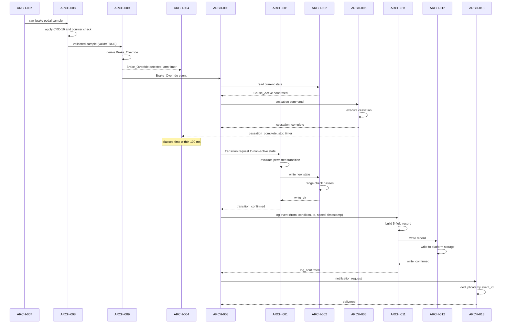
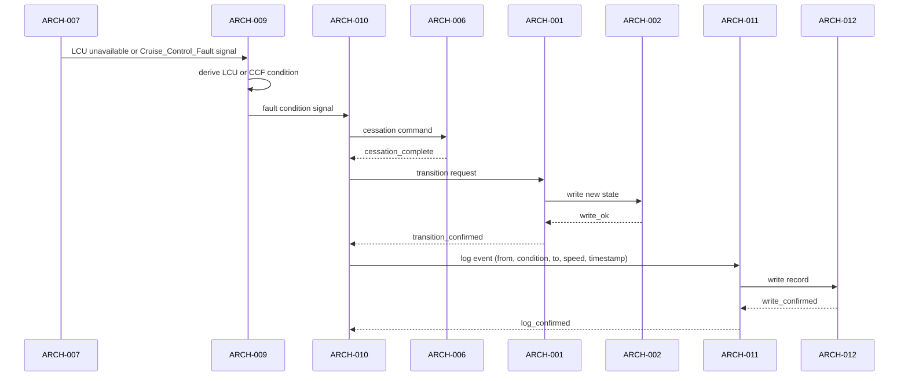
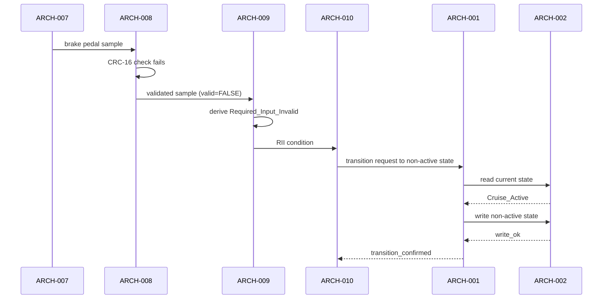

# Architecture Design: Vehicle Cruise Control — Brake Override Safety Slice

**Feature Branch**: `001-cruise-brake-override`
**Created**: 2026-06-02
**Status**: Approved
**Source**: `specs/001-cruise-brake-override/v-model/system-design.md`
**Domain Overlay**: ISO 26262 (ASIL D — Confirmed)

---

## Overview

The eight system components from `system-design.md` are decomposed into sixteen
architecture modules (fourteen functional + two cross-cutting). The decomposition
applies three principles:

1. **ASIL D state protection**: The Cruise State Machine (SYS-001) is split into a
   transition evaluator (ARCH-001) and an independent state register (ARCH-002),
   enabling ASIL B(D)+B(D) decomposition with a spatial independence argument.

2. **Safety response layering**: The Brake Override Response Coordinator (SYS-002)
   is split into a functional sequencer (ARCH-003) and an independent timing
   supervisor (ARCH-004), enabling ASIL B(D)+B(D) decomposition with a functional
   independence argument.

3. **Platform boundary isolation**: All platform reads (ARCH-007) and writes
   (ARCH-006, ARCH-012, ARCH-013) are confined to dedicated adapter modules,
   minimising the interface surface for integrity and cybersecurity analysis.

Two cross-cutting modules are added beyond the SYS decomposition: a Scheduling
Controller (ARCH-015) and a Watchdog Supervisor (ARCH-016). Both are architecturally
necessary for ASIL D temporal isolation per ISO 26262-6 §7.4.4 and are not
traceable to a single SYS component.

---

## ID Schema

- **Architecture Module**: `ARCH-NNN` — sequential, never renumbered.
- **Parent System Components**: comma-separated `SYS-NNN` list (many-to-many).
- **Cross-Cutting**: `[CROSS-CUTTING]` tag with rationale — no SYS parent.
- Example: `ARCH-003` with parent `SYS-002` — module implements SYS-002.
- Example: `ARCH-015 [CROSS-CUTTING]` — scheduling infrastructure, serves all timed modules.

---

## Logical View — Component Breakdown (IEEE 42010 / Kruchten 4+1)

| ARCH ID | Name | Description | Parent System Components | Type |
|---------|------|-------------|--------------------------|------|
| ARCH-001 | State Transition Evaluator | Evaluates condition signals received from ARCH-009 and ARCH-010; determines whether a transition is permitted from the current state; enforces the reactivation guard (activation precondition check); issues state-write requests to ARCH-002 and triggers ARCH-003 on Brake_Override. Evaluates five activation preconditions on every Cruise_Standby-to-Cruise_Active attempt: (1) vehicle speed in valid range, (2) Brake_Override not active, (3) RII not active, (4) CCF not active, (5) LCU not active (DR-001 resolved 2026-06-02; REQ-018). | SYS-001 | Component |
| ARCH-002 | State Register | Stores the single current `CruiseControlState` value; enforces a range check on every write (value must be one of the five defined states); provides a validated read interface; raises `Cruise_Control_Fault` via ARCH-010 on any out-of-range write attempt. Spatially isolated from ARCH-001 to support ASIL B(D)+B(D) decomposition. | SYS-001 | Component |
| ARCH-003 | Override Response Sequencer | Orchestrates the complete Brake_Override response: (1) commands cessation via ARCH-006, (2) notifies ARCH-004 to stop timing, (3) requests event logging via ARCH-011, (4) requests notification via ARCH-013. Implements the sequencing contract: cessation before transition, log confirmed before notification. Accepts Brake_Override events from ARCH-009. | SYS-002 | Component |
| ARCH-004 | Response Timing Supervisor | Independent module that arms a timer when ARCH-009 confirms Brake_Override in `Cruise_Active`; measures elapsed time until ARCH-006 reports cessation complete; raises `Cruise_Control_Fault` via ARCH-010 if cessation is not confirmed within **100 milliseconds** (T_max = 100 ms; OQ-002 resolved 2026-06-02). Functionally independent of ARCH-003 to support ASIL B(D)+B(D) decomposition. | SYS-002 | Component |
| ARCH-005 | Speed Control Regulator | Generates longitudinal speed control output values based on the cruise target and current vehicle speed. Produces commands only when ARCH-002 confirms `Cruise_Active` authorisation on every evaluation cycle. Passes generated commands to ARCH-006 for delivery to the platform interface. | SYS-003 | Component |
| ARCH-006 | Propulsion Interface Adapter | Delivers speed control commands from ARCH-005 to the platform propulsion command interface. Executes immediate cessation (overrides any in-progress command) on a cessation request from ARCH-003 or ARCH-010. Confirms cessation complete to both callers. Enforces the exclusive interface contract: no module other than ARCH-005 and ARCH-006 may write to the propulsion interface. | SYS-003 | Adapter |
| ARCH-007 | Platform Input Reader | Reads all five platform inputs on each monitoring cycle: vehicle speed, brake pedal status, driver command input, diagnostic status, and longitudinal control availability. Delivers raw input samples to ARCH-008 (brake pedal status, driver command) and ARCH-009 (all five). No processing or validation is performed by this module. | SYS-004 | Adapter |
| ARCH-008 | Input Integrity Verifier | Applies **CRC-16 error detection** combined with a **4-bit rolling counter** for replay detection (per REQ-CN-007; OQ resolved 2026-06-02) to brake pedal status and driver command inputs delivered by ARCH-007. Passes validated inputs to ARCH-009 with a validity flag; sets the validity flag to `INVALID` on CRC failure or non-sequential counter, causing ARCH-009 to derive `Required_Input_Invalid`. | SYS-004 | Component |
| ARCH-009 | Condition Deriver | Derives the four named conditions from validated platform inputs: `Brake_Override` from validated brake pedal status, `Longitudinal_Control_Unavailable` from LCU availability input, `Cruise_Control_Fault` from diagnostic status, `Required_Input_Invalid` from ARCH-008's validity flag or out-of-range vehicle speed. Publishes derived conditions to ARCH-001, ARCH-003, and ARCH-010 on change. | SYS-004 | Component |
| ARCH-010 | Fault Condition Handler | Receives `Longitudinal_Control_Unavailable`, `Cruise_Control_Fault`, and `Required_Input_Invalid` condition signals from ARCH-009 (and fault escalations from ARCH-002, ARCH-004, ARCH-006). For each condition, issues the appropriate response: cessation command to ARCH-006 and state transition request to ARCH-001. Also receives Cruise_Control_Fault escalations from ARCH-002 (state range violation), ARCH-004 (timing budget exceeded), and ARCH-012 (write failure per REQ-017; DR-002 resolved 2026-06-02). | SYS-005 | Component |
| ARCH-011 | Event Record Builder | Constructs a complete `StateTransitionEvent` record from a log-event request: populates timestamp, from-state, triggering condition, to-state, and vehicle speed snapshot. Validates that all five fields are non-null and within valid ranges before passing to ARCH-012. Raises a format-violation diagnostic if any field fails validation. | SYS-006 | Component |
| ARCH-012 | Event Storage Adapter | Writes complete event records (received from ARCH-011) to the platform local persistent event storage interface. Waits for synchronous write confirmation from the platform before returning write-complete to the caller (ARCH-003 or ARCH-010). On write failure, raises `Cruise_Control_Fault` via ARCH-010, causing the feature to enter `Cruise_Fault` per REQ-017 (DR-002 resolved 2026-06-02). | SYS-006 | Adapter |
| ARCH-013 | Notification Publisher | Receives notification requests from ARCH-003; deduplicates by event ID to enforce exactly-once delivery; delivers notification events to the platform notification interface. Returns delivery acknowledgement to caller. | SYS-007 | Adapter |
| ARCH-014 | Safety Lifecycle Evidence Set | Represents the set of process artifacts that implement the safety process and compliance obligations of SYS-008: ISO 26262-inspired lifecycle documentation, cybersecurity threat analysis, architecture and design documents, implementation evidence, V&V records, and X-VERSE validation outputs. Verified by inspection (STP-008-A, STP-008-B), not by runtime execution. | SYS-008 | Utility |
| ARCH-015 | Scheduling Controller | `[CROSS-CUTTING]` — Provides bounded cyclic scheduling with a period of **≤ 20 milliseconds** (= T_max ÷ 5 = 100 ms ÷ 5; OQ-002 resolved 2026-06-02) for all periodic monitoring components (ARCH-007, ARCH-009). Enforces the fixed inter-module activation order defined in the Concurrency Model. Required by ASIL D temporal isolation (ISO 26262-6 §7.4.4); the 20 ms period gives ARCH-003/004 five scheduling cycles to complete the override response within T_max. | [CROSS-CUTTING] — temporal isolation infrastructure required for ASIL D compliance | Utility |
| ARCH-016 | Watchdog Supervisor | `[CROSS-CUTTING]` — Monitors scheduled execution of ASIL D modules (ARCH-001 through ARCH-010) within their allocated time slots. If a module misses its execution deadline, ARCH-016 raises `Cruise_Control_Fault` via ARCH-010. Required by ISO 26262-6 §7.4.4 (watchdog timer for ASIL D); cross-cutting because it monitors all safety-critical runtime modules without owning functional behaviour. | [CROSS-CUTTING] — watchdog monitoring required for ASIL D modules | Utility |

---

## Process View — Dynamic Behaviour (Kruchten 4+1)

Participant codes used across all diagrams:

| Code | Module | Role |
|------|--------|------|
| A7 | ARCH-007 | Platform Input Reader |
| A8 | ARCH-008 | Input Integrity Verifier |
| A9 | ARCH-009 | Condition Deriver |
| A4 | ARCH-004 | Response Timing Supervisor |
| A3 | ARCH-003 | Override Response Sequencer |
| A1 | ARCH-001 | State Transition Evaluator |
| A2 | ARCH-002 | State Register |
| A6 | ARCH-006 | Propulsion Interface Adapter |
| A10 | ARCH-010 | Fault Condition Handler |
| A11 | ARCH-011 | Event Record Builder |
| A12 | ARCH-012 | Event Storage Adapter |
| A13 | ARCH-013 | Notification Publisher |

---

### Diagram 1: Brake Override Response (Primary Safety Path)

---

### Diagram 2: Fault Condition Handling (LCU and CCF Path)

---

### Diagram 3: Required_Input_Invalid — Exit from Cruise_Active

---

### Concurrency Model

All modules execute within a bounded cyclic schedule managed by ARCH-015. The execution
order within each cycle is:

1. **ARCH-007** — platform input read (start of cycle)
2. **ARCH-008** — input integrity verification
3. **ARCH-009** — condition derivation and publication
4. **ARCH-001** / **ARCH-003** / **ARCH-004** / **ARCH-010** — reactive modules (any order within cycle, no inter-dependency within same cycle)
5. **ARCH-005** — speed command generation (uses state from ARCH-002; issued after condition processing)
6. **ARCH-006** — propulsion interface write (uses output from ARCH-005 or cessation from ARCH-003/010)
7. **ARCH-011** / **ARCH-012** — event logging (synchronous; blocks transition completion)
8. **ARCH-013** — notification dispatch (last; safety action already complete)

**ARCH-016** monitors that steps 1–6 complete within their allocated time slots.

---

## Interface View — API Contracts (Kruchten 4+1)

### ARCH-001: State Transition Evaluator

| Direction | Name | Type | Format | Constraints |
|-----------|------|------|--------|-------------|
| Input | condition | ControlCondition | enum {Brake_Override, RII, LCU, CCF} | Must be a defined enum value |
| Input | current_state | CruiseControlState | read from ARCH-002 | Must be one of 5 valid states |
| Output | transition_request | StateWrite | struct {new_state: CruiseControlState} | new_state must be in the 5-state set |
| Output | activation_precondition_check | bool | TRUE = all preconditions valid | Evaluated before any Standby→Active transition |
| Exception | INVALID_CONDITION | error_code | E001 | Raised when condition value is undefined |
| Exception | INVALID_TRANSITION | error_code | E002 | Raised when no permitted transition exists for the condition/state pair |

### ARCH-002: State Register

| Direction | Name | Type | Format | Constraints |
|-----------|------|------|--------|-------------|
| Input | state_write | StateWrite | struct {new_state: CruiseControlState} | new_state must be in {Cruise_Standby, Cruise_Active, Cruise_Suspended, Cruise_Cancelled, Cruise_Fault} |
| Output | state_read | CruiseControlState | enum (5 values) | Never returns a value outside the 5-state set |
| Exception | RANGE_VIOLATION | error_code | E010 | Raised when state_write value is outside the 5-state set; triggers CCF escalation via ARCH-010 |

### ARCH-003: Override Response Sequencer

| Direction | Name | Type | Format | Constraints |
|-----------|------|------|--------|-------------|
| Input | brake_override_event | BrakeOverrideEvent | struct {timestamp, vehicle_speed_snapshot} | Accepted only when ARCH-002 reports Cruise_Active |
| Output | cessation_command | CessationCommand | void signal | Delivered to ARCH-006; cessation_complete acknowledgement required |
| Output | log_event_request | LogEventRequest | struct {from_state, condition, to_state, speed, timestamp} | Delivered to ARCH-011; log_confirmed acknowledgement required before completion |
| Output | notification_request | NotificationRequest | struct {event_id, event_type=Brake_Override} | Delivered to ARCH-013 after log_confirmed |
| Exception | CESSATION_TIMEOUT | error_code | E020 | Raised if cessation_complete not received within one cycle; escalated to ARCH-010 |
| Exception | LOG_FAILURE | error_code | E021 | Raised if log_confirmed not received (per DR-002 resolution) |

### ARCH-004: Response Timing Supervisor

| Direction | Name | Type | Format | Constraints |
|-----------|------|------|--------|-------------|
| Input | arm_timer | TimerArm | struct {timestamp_start} | Triggered on confirmed Brake_Override in Cruise_Active |
| Input | stop_timer | TimerStop | struct {timestamp_stop} | Triggered on cessation_complete from ARCH-006 |
| Output | timing_ok | TimingResult | bool TRUE | Emitted when cessation confirmed within 100 ms (T_max = 100 ms) |
| Exception | TIMING_EXCEEDED | error_code | E030 | Raised when cessation not confirmed within 100 ms; escalated to ARCH-010 as CCF |

### ARCH-005: Speed Control Regulator

| Direction | Name | Type | Format | Constraints |
|-----------|------|------|--------|-------------|
| Input | authorisation | CruiseControlState | read from ARCH-002 | Command generation permitted only when state == Cruise_Active |
| Input | vehicle_speed | SpeedValue | physical unit TBD at implementation | Within defined valid range |
| Input | cruise_target | SpeedValue | physical unit TBD | Within defined valid range |
| Output | speed_command | SpeedCommand | struct {command_value} | Delivered to ARCH-006; zero if not authorised |
| Exception | NOT_AUTHORISED | none | — | No exception raised; command generation simply suppressed; ARCH-006 receives zero-command |

### ARCH-006: Propulsion Interface Adapter

| Direction | Name | Type | Format | Constraints |
|-----------|------|------|--------|-------------|
| Input | speed_command | SpeedCommand | from ARCH-005 | Accepted when Cruise_Active; overridden by cessation |
| Input | cessation_command | CessationCommand | from ARCH-003 or ARCH-010 | Unconditional; supersedes any in-progress command |
| Output | platform_propulsion_write | PropulsionCommand | platform-defined format | Exclusive; no other module may write this interface |
| Output | cessation_complete | CessationAck | void signal | Returned to caller (ARCH-003 or ARCH-010) after platform write confirms cessation |
| Exception | WRITE_FAILURE | error_code | E040 | Raised if platform interface write fails; escalated to ARCH-010 |

### ARCH-007: Platform Input Reader

| Direction | Name | Type | Format | Constraints |
|-----------|------|------|--------|-------------|
| Output | brake_status_raw | RawBrakePedalStatus | platform-defined | Unvalidated; passed to ARCH-008 and ARCH-009 |
| Output | driver_command_raw | RawDriverCommand | platform-defined | Unvalidated; passed to ARCH-008 |
| Output | vehicle_speed | SpeedValue | platform-defined | Passed to ARCH-009; used in event records |
| Output | diagnostic_status | DiagnosticStatus | platform-defined | Passed to ARCH-009 |
| Output | lcu_availability | LCUAvailability | boolean | Passed to ARCH-009 |
| Exception | READ_TIMEOUT | error_code | E050 | Raised if any platform input does not deliver within one cycle; escalated to ARCH-009 as RII |

### ARCH-008: Input Integrity Verifier

| Direction | Name | Type | Format | Constraints |
|-----------|------|------|--------|-------------|
| Input | brake_status_raw | RawBrakePedalStatus | from ARCH-007 | Any raw value |
| Input | driver_command_raw | RawDriverCommand | from ARCH-007 | Any raw value |
| Output | brake_status_verified | VerifiedInput | struct {value, validity: bool} | validity=FALSE triggers RII in ARCH-009 |
| Output | driver_command_verified | VerifiedInput | struct {value, validity: bool} | validity=FALSE triggers RII in ARCH-009 |
| Exception | INTEGRITY_MECHANISM_FAULT | error_code | E060 | Raised if the integrity check mechanism itself fails; triggers CCF via ARCH-010 |

### ARCH-009: Condition Deriver

| Direction | Name | Type | Format | Constraints |
|-----------|------|------|--------|-------------|
| Input | brake_status_verified | VerifiedInput | from ARCH-008 | validity=FALSE → RII |
| Input | driver_command_verified | VerifiedInput | from ARCH-008 | validity=FALSE → RII |
| Input | vehicle_speed | SpeedValue | from ARCH-007 | Out-of-range → RII |
| Input | diagnostic_status | DiagnosticStatus | from ARCH-007 | Cruise_Control_Fault signal → CCF |
| Input | lcu_availability | LCUAvailability | from ARCH-007 | Unavailable → LCU |
| Output | condition_signal | ControlCondition | enum per condition | Published to ARCH-001, ARCH-003, ARCH-004, ARCH-010 on change |
| Output | brake_override_event | BrakeOverrideEvent | struct {timestamp, vehicle_speed_snapshot} | Published to ARCH-003 only when condition == Brake_Override in Cruise_Active |

### ARCH-010: Fault Condition Handler

| Direction | Name | Type | Format | Constraints |
|-----------|------|------|--------|-------------|
| Input | fault_condition | ControlCondition | LCU, CCF, or RII | Received from ARCH-009 or escalated from ARCH-002/004/006/012 |
| Output | cessation_command | CessationCommand | void signal | To ARCH-006; for LCU and CCF conditions only |
| Output | transition_request | struct {condition, target_state} | internal format | To ARCH-001 |
| Exception | TRANSITION_REJECTED | error_code | E070 | Raised when ARCH-001 rejects transition (ARCH-001 is locked); escalates to CCF |

### ARCH-011: Event Record Builder

| Direction | Name | Type | Format | Constraints |
|-----------|------|------|--------|-------------|
| Input | log_event_request | LogEventRequest | struct {from_state, condition, to_state, timestamp, vehicle_speed} | All 5 fields must be non-null |
| Output | event_record | StateTransitionEvent | struct {5 fields} | All fields validated and populated |
| Exception | FIELD_VALIDATION_FAILURE | error_code | E080 | Raised when any field is null, empty, or out of valid range; diagnostic logged; record not forwarded to ARCH-012 |

### ARCH-012: Event Storage Adapter

| Direction | Name | Type | Format | Constraints |
|-----------|------|------|--------|-------------|
| Input | event_record | StateTransitionEvent | from ARCH-011 | Complete 5-field record |
| Output | platform_storage_write | StorageWrite | platform-defined format | Exclusive use of platform event storage interface |
| Output | write_confirmed | WriteAck | void signal | Returned to caller (ARCH-003 or ARCH-010) after platform confirms write |
| Exception | WRITE_FAILURE | error_code | E090 | Raised if platform storage write fails; escalated to ARCH-010 as CCF per REQ-017 (DR-002 resolved 2026-06-02) |

### ARCH-013: Notification Publisher

| Direction | Name | Type | Format | Constraints |
|-----------|------|------|--------|-------------|
| Input | notification_request | NotificationRequest | struct {event_id, event_type} | event_id used for deduplication |
| Output | platform_notification_write | NotificationEvent | platform-defined format | One delivery per unique event_id |
| Output | delivered | DeliveryAck | void signal | Returned to caller after platform notification interface confirms receipt |
| Exception | DELIVERY_FAILURE | error_code | E100 | Raised if platform notification write fails; diagnostic logged |

### ARCH-014: Safety Lifecycle Evidence Set

| Direction | Name | Type | Format | Constraints |
|-----------|------|------|--------|-------------|
| N/A | Lifecycle artifact set | Document collection | All V-Model documents (spec, req, design, tests, trace) | Verified by inspection (STP-008-A); completeness per confirmed ASIL level (OQ-001) |

### ARCH-015: Scheduling Controller `[CROSS-CUTTING]`

| Direction | Name | Type | Format | Constraints |
|-----------|------|------|--------|-------------|
| Output | activation_tick | ScheduleTick | void per module | Delivered to ARCH-007 at start of each cycle; subsequent activations follow fixed order |
| Output | execution_deadline | Deadline | struct {module_id, deadline_ms} | Passed to ARCH-016 for monitoring |
| Exception | SCHEDULE_OVERRUN | error_code | E110 | Raised if prior cycle did not complete before next tick; escalated to ARCH-016 |

### ARCH-016: Watchdog Supervisor `[CROSS-CUTTING]`

| Direction | Name | Type | Format | Constraints |
|-----------|------|------|--------|-------------|
| Input | execution_deadline | Deadline | from ARCH-015 | Per-module deadline |
| Input | completion_signal | CompletionAck | void per module | Modules signal completion at end of their slot |
| Exception | WATCHDOG_TIMEOUT | error_code | E120 | Raised when a module does not signal completion before deadline; triggers CCF via ARCH-010 |

---

## Data Flow View — Data Transformation Chains (Kruchten 4+1)

### Flow 1: Brake Pedal Input to Condition Derivation

| Stage | Module | Input | Transformation | Output |
|-------|--------|-------|----------------|--------|
| 1 | ARCH-007 | Platform brake pedal status (raw) | Read from platform interface; no transformation | `RawBrakePedalStatus` |
| 2 | ARCH-008 | `RawBrakePedalStatus` | Apply integrity check (CRC / range / sequence per design); set validity flag | `VerifiedInput {value, validity}` |
| 3 | ARCH-009 | `VerifiedInput {validity=TRUE, applied=TRUE}` | Map to Brake_Override condition | `ControlCondition = Brake_Override` |
| 3a | ARCH-009 | `VerifiedInput {validity=FALSE}` | Map integrity failure to RII | `ControlCondition = Required_Input_Invalid` |
| 4 | ARCH-003 | `Brake_Override event {timestamp, speed}` | Trigger override response sequence | Cessation + Log + Notify commands |

### Flow 2: State Transition to Audit Record

| Stage | Module | Input | Transformation | Output |
|-------|--------|-------|----------------|--------|
| 1 | ARCH-001 | `{condition=Brake_Override, current_state=Cruise_Active}` | Evaluate permitted transition; select target state | `StateWrite {new_state=<target>}` |
| 2 | ARCH-002 | `StateWrite {new_state}` | Range check; persist | `CruiseControlState = <target>` |
| 3 | ARCH-003 | `{from=Cruise_Active, cond=Brake_Override, to=<target>, speed=V, ts=T}` | Assemble log request | `LogEventRequest {5 fields}` |
| 4 | ARCH-011 | `LogEventRequest {5 fields}` | Validate fields; construct record | `StateTransitionEvent {5 fields validated}` |
| 5 | ARCH-012 | `StateTransitionEvent` | Write to platform storage; await confirmation | `WriteAck` |

### Flow 3: Fault Escalation to Cruise_Fault

| Stage | Module | Input | Transformation | Output |
|-------|--------|-------|----------------|--------|
| 1 | ARCH-002 | State range violation (out-of-set write) | Detect violation | `RANGE_VIOLATION` → ARCH-010 |
| 1a | ARCH-004 | Cessation timeout (T_max exceeded) | Detect timeout | `TIMING_EXCEEDED` → ARCH-010 |
| 2 | ARCH-010 | `CCF signal` | Route to Cruise_Fault transition | `transition_request {Cruise_Fault}` |
| 3 | ARCH-001 | `transition_request {Cruise_Fault}` | Unconditional transition to Cruise_Fault | `StateWrite {Cruise_Fault}` |
| 4 | ARCH-002 | `StateWrite {Cruise_Fault}` | Range check passes; persist | `CruiseControlState = Cruise_Fault` |

---

## Safety-Critical Architecture Sections (ISO 26262 Overlay)

### ASIL Decomposition (ISO 26262-9 §5)

Two ASIL D decompositions are **confirmed** (OQ-001 resolved 2026-06-02). Each requires an independence argument to be validated at implementation phase:

| Parent Component | Parent ASIL | Child Module A | Child ASIL | Child Module B | Child ASIL | Independence Argument |
|------------------|-------------|---------------|------------|---------------|------------|----------------------|
| SYS-001 (State Machine) | ASIL D | ARCH-001 (State Transition Evaluator) | ASIL B(D) | ARCH-002 (State Register) | ASIL B(D) | Spatial: ARCH-002 is a separate executable unit with its own data region; ARCH-001 cannot corrupt ARCH-002's state variable directly; the range check in ARCH-002 is independent of ARCH-001's logic |
| SYS-002 (Override Response Coordinator) | ASIL D | ARCH-003 (Override Response Sequencer) | ASIL B(D) | ARCH-004 (Response Timing Supervisor) | ASIL B(D) | Functional: ARCH-003 implements the functional response sequence; ARCH-004 independently monitors the timing budget without participating in the sequence; different algorithm, different data, no shared state |

**Conditions for decomposition to be valid** (ISO 26262-9 §5.4):
- Spatial independence (SYS-001): memory protection unit must prevent ARCH-001 from writing ARCH-002's state register region directly. This must be confirmed at implementation phase.
- Functional independence (SYS-002): ARCH-003 and ARCH-004 must use different algorithms and have no shared writable data. The timing budget (T_max = 100 ms; OQ-002 resolved) is read-only from both modules.

### Defensive Programming (ISO 26262-6 §7.4.2)

Every ASIL B–D module has at least one defensive mechanism at its input boundary:

| Module | ASIL | Invalid Input Scenario | Detection Method | Recovery Action |
|--------|------|----------------------|------------------|-----------------|
| ARCH-001 | ASIL B(D) | Undefined condition value received | Enum range check on arrival | Raise INVALID_CONDITION (E001); do not evaluate transition |
| ARCH-002 | ASIL B(D) | State value outside 5-state set on write | Enumeration range check | Raise RANGE_VIOLATION (E010); escalate CCF via ARCH-010; do not write |
| ARCH-003 | ASIL B(D) | Brake_Override event received when not in Cruise_Active | State guard: read ARCH-002 before sequencing | Discard event; no response sequence initiated |
| ARCH-004 | ASIL B(D) | Timer armed multiple times within same cycle | Monotone timestamp check: reject arm if already armed | Log diagnostic; continue with first arm time |
| ARCH-005 | ASIL D | Speed command generated when not authorised | Authorization gate: check ARCH-002 state before generating command | Suppress command; output zero to ARCH-006 |
| ARCH-006 | ASIL D | Write to propulsion interface when not in Cruise_Active | Authorization check on every write | Block write; raise WRITE_FAILURE (E040) |
| ARCH-008 | ASIL D | Integrity check mechanism itself fails | Self-test assertion on check function | Raise INTEGRITY_MECHANISM_FAULT (E060); trigger CCF |
| ARCH-009 | ASIL D | Vehicle speed value outside physical range | Plausibility check (V_min ≤ speed ≤ V_max) | Derive Required_Input_Invalid |
| ARCH-010 | ASIL D | Unknown fault condition code received | Enum range check | Raise diagnostic; default to CCF escalation |
| ARCH-011 | ASIL D | Log event request with null or invalid field | Five-field validation before record construction | Raise FIELD_VALIDATION_FAILURE (E080); do not write |
| ARCH-016 | ASIL D | Module completion signal not received | Deadline monitoring via ARCH-015 schedule | Raise WATCHDOG_TIMEOUT (E120); trigger CCF |

### Temporal and Execution Constraints (ISO 26262-6 §7.4.4)

| Module | ASIL | Constraint Type | Value | Enforcement |
|--------|------|----------------|-------|-------------|
| ARCH-003 | ASIL B(D) | End-to-end deadline (cessation confirmed) | ≤ **100 ms** (OQ-002 resolved 2026-06-02) | ARCH-004 raises CCF if deadline missed |
| ARCH-015 | [CROSS-CUTTING] | Scheduling period | ≤ **20 ms** (= T_max ÷ 5; OQ-002 resolved 2026-06-02) | Fixed cyclic schedule enforced by platform clock |
| ARCH-004 | ASIL B(D) | WCET for timer evaluation | To be defined at implementation | ARCH-016 watchdog |
| ARCH-005 | ASIL D | Execution before ARCH-006 in each cycle | Must precede ARCH-006 | ARCH-015 fixed schedule order |
| ARCH-007 | ASIL D | Execution at start of each cycle | First in schedule | ARCH-015 cycle tick |
| ARCH-008 | ASIL D | Execution before ARCH-009 in each cycle | After ARCH-007; before ARCH-009 | ARCH-015 fixed schedule order |
| ARCH-009 | ASIL D | Condition signal published in same cycle as input | Within one monitoring cycle | ARCH-015 |
| ARCH-016 | ASIL D | Deadline monitoring for all ASIL D modules | One watchdog period per module slot | Independent from monitored modules |
| All ASIL D runtime | ASIL D | Watchdog kick | Must be received by ARCH-016 each cycle | ARCH-016 timeout = one cycle period |

---

## Architecture Evaluation (ISO/IEC 42030:2019 / ISO/IEC 25010:2023)

### Quality Attribute Justification

| Architecture Decision | Quality Characteristic (ISO 25010) | Trade-off Accepted |
|----------------------|------------------------------------|--------------------|
| ARCH-001/002 ASIL B(D)+B(D) decomposition (separate state register and evaluator) | Safety §4.2.9 ↑, Maintainability §4.2.7 ↑ | Slight increase in call overhead between evaluator and register; accepted because the independence argument strengthens ASIL D justification |
| ARCH-004 as independent timing supervisor | Safety §4.2.9 ↑, Performance §4.2.3 minor ↓ | Extra module adds one scheduling slot per cycle; accepted because the timing budget (OQ-002) is a hard safety requirement |
| Dedicated ARCH-008 integrity verifier | Security §4.2.5 ↑, Compatibility § maintained | Integrity check isolated from condition derivation; tampering changes affect ARCH-008 without corrupting ARCH-009 logic; slight latency addition accepted |
| Synchronous write confirmation in ARCH-012 | Reliability §4.2.2 ↑ (evidence integrity), Performance §4.2.3 ↓ | Synchronous wait for storage confirmation adds latency to the transition cycle; accepted because incomplete audit records are a safety evidence gap (HAZ-016) |
| ARCH-015/016 as cross-cutting scheduling and watchdog | Reliability §4.2.2 ↑, Safety §4.2.9 ↑ | Extra cross-cutting modules increase integration surface; accepted because ASIL D temporal isolation is a hard constraint (ISO 26262-6 §7.4.4) |

### Fitness-for-Purpose Scenario Analysis (ISO/IEC 42030:2019 §6)

| Quality Scenario | Architecture Response | Risk / Sensitivity Point | Verdict |
|-----------------|----------------------|--------------------------|---------|
| Brake_Override response within 100 ms (HAZ-006) | ARCH-003 (sequencer) + ARCH-004 (timing supervisor); cessation via ARCH-006 within one control cycle; scheduling period ≤ 20 ms | T_max = 100 ms (OQ-002 resolved 2026-06-02); ARCH-004 enforces via CCF escalation; 5 scheduling cycles available within T_max | ✅ Addressed |
| No speed commands issued in non-active state (HAZ-008) | ARCH-006 exclusive interface guard + ARCH-002 state register; gate checked on every command | Single point of failure: if ARCH-002's state read is corrupted, ARCH-006 may issue commands; mitigated by ASIL B(D)+B(D) decomposition | ✅ Addressed |
| Tampered brake signal suppresses Brake_Override (HAZ-010) | ARCH-008 applies CRC-16 + 4-bit rolling counter (REQ-CN-007; resolved 2026-06-02); CRC failure or non-sequential counter → RII → prevents false Cruise_Active continuation | Algorithm confirmed; cybersecurity threat analysis (REQ-CN-003) must verify CRC-16 + counter addresses all identified replay/forge threat classes before field trials | ⚠️ Partially Addressed `[ARCH CONCERN: threat analysis (REQ-CN-003) must confirm CRC-16 + 4-bit counter covers all identified attack classes for this platform]` |
| Audit reconstruction from event log (HAZ-016/017) | ARCH-011 five-field validation + ARCH-012 synchronous write confirmation; write failure → Cruise_Fault per REQ-017 | DR-002 resolved 2026-06-02: write failure escalates to Cruise_Control_Fault; no transition proceeds without a confirmed audit record | ✅ Addressed |
| ASIL D WCET and scheduling bounded (temporal isolation) | ARCH-015 fixed-order cyclic schedule (period ≤ 20 ms) + ARCH-016 watchdog | Scheduling period is defined (OQ-002 resolved); individual per-module WCET values must be measured and confirmed to fit within the 20 ms period at implementation phase | ⚠️ Partially Addressed `[ARCH CONCERN: per-module WCET analysis required at implementation phase to confirm all module budgets fit within the 20 ms scheduling period]` |

### Sensitivity and Trade-off Points

**Sensitivity points** (small change → large quality impact):
- The timing budget (OQ-002) is a sensitivity point for the entire Brake_Override safety chain. If T_max is set too tightly, ARCH-003 and ARCH-004 may require hardware acceleration. If set too loosely, HAZ-006 residual risk increases.
- The ASIL decomposition independence argument (ARCH-001/002 and ARCH-003/004) is sensitive to implementation choices: if ARCH-001 and ARCH-002 share memory space without MPU enforcement, the independence argument fails and the full SYS-001/002 must be implemented at ASIL D without decomposition.

**Trade-off points**:
- Synchronous vs asynchronous logging (ARCH-012): synchronous write adds latency but provides integrity evidence (HAZ-016 mitigation); asynchronous would reduce latency but requires DR-002 to be resolved as "transition proceeds without confirmation" with acceptable justification.
- ASIL decomposition vs monolithic ASIL D: decomposing ARCH-001/002 and ARCH-003/004 reduces per-module rigor requirements (ASIL B vs D) but requires rigorous independence arguments; a monolithic ASIL D approach is simpler to argue but more expensive to implement and verify.

---

## Coverage Summary

| Metric | Value |
|--------|-------|
| Total Architecture Modules | 16 |
| By Type | Component: 8 · Adapter: 4 · Utility: 2 · [CROSS-CUTTING]: 2 |
| SYS → ARCH Forward Coverage | 8/8 (100%) |
| Interface Contracts Defined | 16/16 (100%) |
| Mermaid Sequence Diagrams | 3 |
| Derived Modules | 0 |
| Arch Concerns Resolved | 2 (OQ-002 timing budget → T_max = 100 ms; DR-002 write failure → REQ-017 / Cruise_Fault) |
| Arch Concerns Remaining | 2 (cybersecurity threat analysis REQ-CN-003 must confirm CRC-16+counter coverage; per-module WCET analysis required at implementation phase) |
| Safety-Critical Sections | ASIL decomposition · Defensive programming · Temporal constraints |

---

## Derived Modules

None identified. All 16 modules are traceable to a SYS parent or justified as
`[CROSS-CUTTING]` with a documented rationale.
