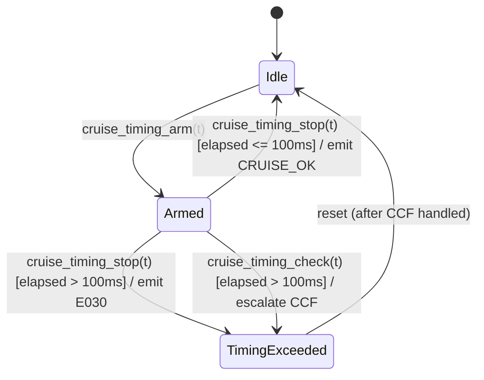
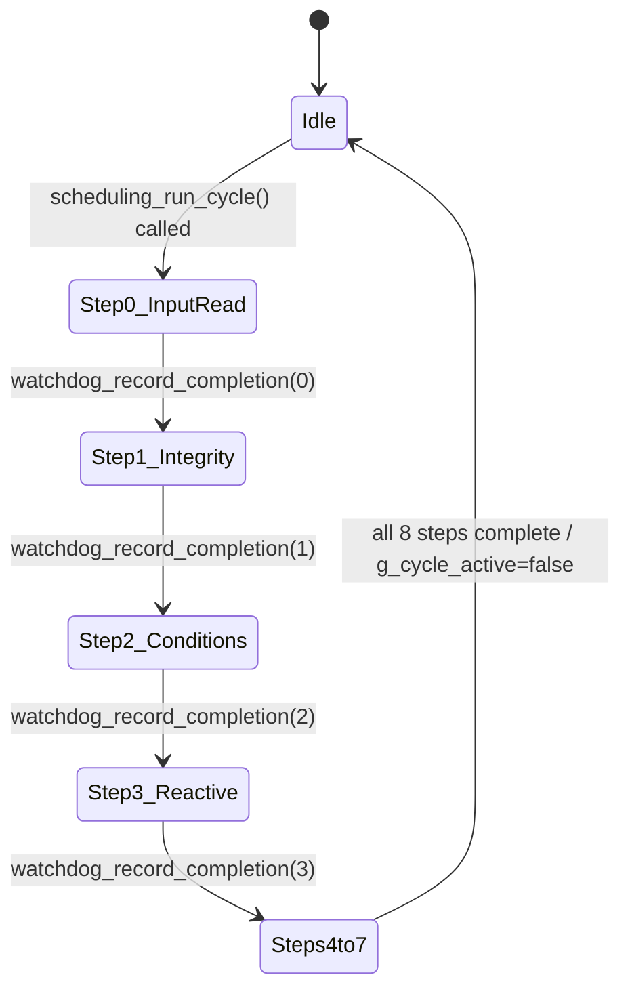
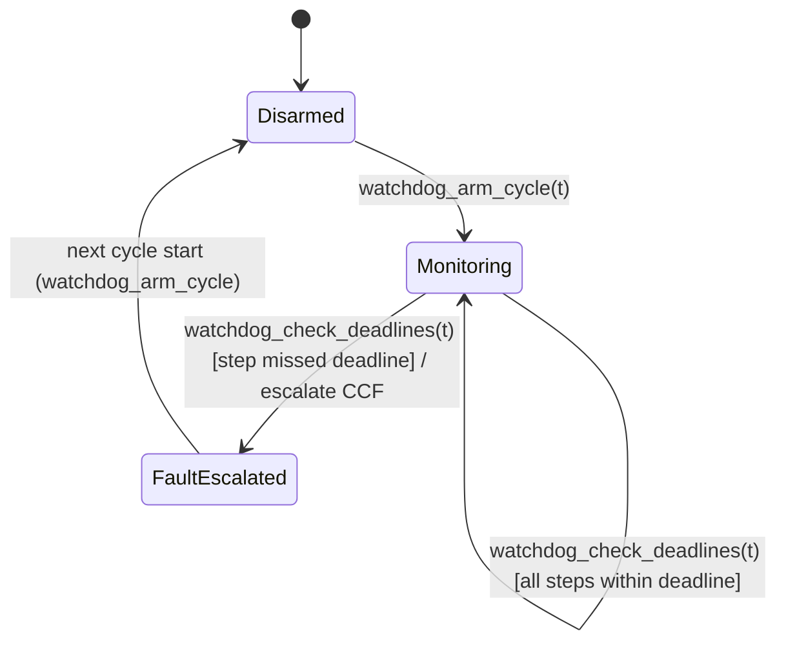

# Module Design: Vehicle Cruise Control — Brake Override Safety Slice

**Feature Branch**: `001-cruise-brake-override`
**Created**: 2026-06-02
**Status**: Approved
**Source**: `specs/001-cruise-brake-override/v-model/architecture-design.md`
**Domain**: ISO 26262 (ASIL D — Confirmed)
**Language**: C + MISRA C:2012 (OQ-005 resolved 2026-06-02)

---

## Overview

The 16 architecture modules decompose into 17 implementation modules (ARCH-001 yields
two modules). Every module is specified at the level where coding is a translation
exercise — all design decisions are made here. Pseudocode uses C-style notation
consistent with the MISRA C:2012 coding standard.

**Decomposition rationale:**
- One C translation unit per logical responsibility (one `.h` + one `.c` pair per cluster)
- All functions have a single entry point and a single exit (MISRA C:2012 Rule 15.5)
- No dynamic allocation after initialisation (ISO 26262-6 §8.4.5 Table 13)
- All loops have a provable worst-case iteration bound

---

## ID Schema

- **Module**: `MOD-NNN` — sequential, independent of ARCH numbering
- **Parent Architecture Modules**: authoritative traceability field (many-to-many)
- **Target Source File(s)**: repository-relative paths

### Module–to–Source File Map

| MOD | Name | Parent ARCH | Source Files |
|-----|------|-------------|-------------|
| MOD-001 | cruise_eval_transition | ARCH-001 | `src/cruise_control/state_machine.h`, `src/cruise_control/state_machine.c` |
| MOD-002 | cruise_check_preconditions | ARCH-001 | same files as MOD-001 |
| MOD-003 | cruise_state_register | ARCH-002 | same files as MOD-001 |
| MOD-004 | cruise_sequence_override | ARCH-003 | `src/cruise_control/override_response.h`, `src/cruise_control/override_response.c` |
| MOD-005 | cruise_timing_supervisor | ARCH-004 | same files as MOD-004 |
| MOD-006 | cruise_generate_speed_cmd | ARCH-005 | `src/cruise_control/speed_controller.h`, `src/cruise_control/speed_controller.c` |
| MOD-007 | cruise_propulsion_write | ARCH-006 | same files as MOD-006 |
| MOD-008 | cruise_read_platform_inputs | ARCH-007 | `src/cruise_control/input_monitor.h`, `src/cruise_control/input_monitor.c` |
| MOD-009 | cruise_verify_integrity | ARCH-008 | same files as MOD-008 |
| MOD-010 | cruise_derive_conditions | ARCH-009 | same files as MOD-008 |
| MOD-011 | cruise_handle_fault | ARCH-010 | `src/cruise_control/fault_handler.h`, `src/cruise_control/fault_handler.c` |
| MOD-012 | cruise_build_event_record | ARCH-011 | `src/cruise_control/event_logger.h`, `src/cruise_control/event_logger.c` |
| MOD-013 | cruise_write_event_record | ARCH-012 | same files as MOD-012 |
| MOD-014 | cruise_publish_notification | ARCH-013 | `src/cruise_control/notification.h`, `src/cruise_control/notification.c` |
| MOD-015 | lifecycle_evidence_manifest | ARCH-014 | `docs/lifecycle/evidence_manifest.md` |
| MOD-016 | scheduling_controller | ARCH-015 | `src/platform/scheduling.h`, `src/platform/scheduling.c` |
| MOD-017 | watchdog_supervisor | ARCH-016 | `src/platform/watchdog.h`, `src/platform/watchdog.c` |

---

## Module Designs

---

### Module: MOD-001 (cruise_eval_transition)

**Parent Architecture Modules**: ARCH-001
**Parent Requirements**: REQ-001, REQ-004, REQ-005, REQ-007, REQ-008, REQ-010, REQ-011, REQ-018
**ASIL**: ASIL D — Confirmed
**Target Source File(s)**: `src/cruise_control/state_machine.h`, `src/cruise_control/state_machine.c`

#### 1. Algorithmic / Logic View

```pseudocode
/*
 * cruise_eval_transition
 * Evaluates whether a given condition triggers a permitted transition
 * from the current state, writes the new state, and returns the outcome.
 * Single entry, single exit (result variable pattern).
 *
 * Pre-condition:  condition is a valid ControlCondition_t value
 * Post-condition: if CRUISE_OK, state register holds new state;
 *                 if error, state register is unchanged
 */
ErrorCode_t cruise_eval_transition(ControlCondition_t condition)
{
    ErrorCode_t         result        = CRUISE_ERR_INVALID_CONDITION;
    CruiseControlState_t current      = cruise_state_read();
    CruiseControlState_t next_state   = current;
    bool                 permitted    = false;

    /* Validate condition is within the defined enum range */
    if ((condition < CONDITION_MIN) || (condition > CONDITION_MAX)) {
        result = CRUISE_ERR_INVALID_CONDITION;   /* E001 — exit via result */
    }
    else {
        /* Transition table: (current_state, condition) -> (next_state, permitted) */
        switch (current) {
            case CRUISE_ACTIVE:
                if (condition == COND_BRAKE_OVERRIDE) {
                    next_state = CRUISE_CANCELLED;  permitted = true;
                } else if (condition == COND_LCU) {
                    next_state = CRUISE_CANCELLED;  permitted = true;
                } else if (condition == COND_RII) {
                    next_state = CRUISE_CANCELLED;  permitted = true;
                } else if (condition == COND_CCF) {
                    next_state = CRUISE_FAULT;      permitted = true;
                }
                break;

            case CRUISE_STANDBY:
                if (condition == COND_CCF) {
                    next_state = CRUISE_FAULT;      permitted = true;
                }
                break;

            case CRUISE_CANCELLED:   /* fall-through */
            case CRUISE_SUSPENDED:
                if (condition == COND_CCF) {
                    next_state = CRUISE_FAULT;      permitted = true;
                }
                break;

            case CRUISE_FAULT:
                /* No outgoing transitions from CRUISE_FAULT via condition signals */
                permitted = false;
                break;

            default:
                result = CRUISE_ERR_INVALID_TRANSITION;
                break;
        }

        if (permitted) {
            result = cruise_state_write(next_state);  /* MOD-003: range-checked write */
        } else if (result == CRUISE_ERR_INVALID_CONDITION) {
            /* result already set */
        } else {
            result = CRUISE_ERR_INVALID_TRANSITION;   /* E002 */
        }
    }

    return result;
}
```

#### 2. State Machine View

N/A — Stateless. cruise_eval_transition is a pure function of (condition, current_state).
State persistence belongs to MOD-003 (State Register).

#### 3. Internal Data Structures

| Name | Type | Scope | Init | Constraint |
|------|------|-------|------|-----------|
| `current` | `CruiseControlState_t` | local | from `cruise_state_read()` | one of 5 valid enum values |
| `next_state` | `CruiseControlState_t` | local | `= current` | one of 5 valid enum values |
| `permitted` | `bool` | local | `false` | set by transition table |
| `result` | `ErrorCode_t` | local | `CRUISE_ERR_INVALID_CONDITION` | single-exit accumulator |

#### 4. Error Handling & Return Codes

| Error | Code | Trigger | Action |
|-------|------|---------|--------|
| Invalid condition value | `CRUISE_ERR_INVALID_CONDITION` (E001) | condition outside enum range | return E001; no state write |
| No permitted transition | `CRUISE_ERR_INVALID_TRANSITION` (E002) | no match in transition table | return E002; no state write |
| State write range violation | `CRUISE_ERR_RANGE_VIOLATION` (E010) | propagated from MOD-003 | return E010 as-is |
| Success | `CRUISE_OK` | permitted transition written | state register updated |

---

### Module: MOD-002 (cruise_check_preconditions)

**Parent Architecture Modules**: ARCH-001
**Parent Requirements**: REQ-005, REQ-018
**ASIL**: ASIL D — Confirmed
**Target Source File(s)**: `src/cruise_control/state_machine.h`, `src/cruise_control/state_machine.c`

#### 1. Algorithmic / Logic View

```pseudocode
/*
 * cruise_check_preconditions
 * Evaluates the five activation preconditions (REQ-018).
 * Returns true only when ALL five are simultaneously satisfied.
 * Called by the activation request handler before permitting
 * Cruise_Standby -> Cruise_Active.
 *
 * Pre-condition:  flags is a fully populated PreconditionFlags_t struct
 * Post-condition: return value reflects AND of all five checks
 */
bool cruise_check_preconditions(const PreconditionFlags_t *flags)
{
    bool result = false;

    if (flags == NULL) {
        result = false;  /* null guard — treat as failed */
    } else {
        /* All five conditions must be FALSE (not active) */
        bool speed_ok   = flags->speed_in_valid_range;    /* TRUE = speed within range */
        bool brake_ok   = !flags->brake_override_active;  /* TRUE = brake not applied */
        bool rii_ok     = !flags->rii_active;             /* TRUE = inputs valid */
        bool ccf_ok     = !flags->ccf_active;             /* TRUE = no fault */
        bool lcu_ok     = !flags->lcu_active;             /* TRUE = control available */

        result = speed_ok && brake_ok && rii_ok && ccf_ok && lcu_ok;
    }

    return result;
}
```

#### 2. State Machine View

N/A — Stateless pure predicate function.

#### 3. Internal Data Structures

| Name | Type | Scope | Init | Constraint |
|------|------|-------|------|-----------|
| `flags` | `const PreconditionFlags_t *` | parameter | caller-provided | must be non-NULL |
| `speed_ok` … `lcu_ok` | `bool` | local | from struct fields | boolean |
| `result` | `bool` | local | `false` | single-exit accumulator |

`PreconditionFlags_t` struct (defined in `state_machine.h`):
```pseudocode
typedef struct {
    bool speed_in_valid_range;  /* vehicle speed within activation speed range */
    bool brake_override_active; /* brake pedal applied */
    bool rii_active;            /* Required_Input_Invalid active */
    bool ccf_active;            /* Cruise_Control_Fault active */
    bool lcu_active;            /* Longitudinal_Control_Unavailable active */
} PreconditionFlags_t;
```

#### 4. Error Handling & Return Codes

| Error | Trigger | Action |
|-------|---------|--------|
| Null pointer | `flags == NULL` | return `false` (treat as all preconditions failed) |
| All satisfied | — | return `true` |
| Any unsatisfied | — | return `false` |

---

### Module: MOD-003 (cruise_state_register)

**Parent Architecture Modules**: ARCH-002
**Parent Requirements**: REQ-001, REQ-004, REQ-018
**ASIL**: ASIL B(D) — Confirmed (ASIL decomposition of SYS-001)
**Target Source File(s)**: `src/cruise_control/state_machine.h`, `src/cruise_control/state_machine.c`

#### 1. Algorithmic / Logic View

```pseudocode
/* Module-level static state — only accessible via cruise_state_read / cruise_state_write */
static CruiseControlState_t g_cruise_state = CRUISE_STANDBY;

/*
 * cruise_state_write
 * Writes new_state if it is within the valid 5-state set.
 * Escalates Cruise_Control_Fault via MOD-011 on range violation.
 */
ErrorCode_t cruise_state_write(CruiseControlState_t new_state)
{
    ErrorCode_t result = CRUISE_ERR_RANGE_VIOLATION;  /* E010 — default to failure */

    if (cruise_is_valid_state(new_state)) {
        g_cruise_state = new_state;
        result = CRUISE_OK;
    } else {
        /* Range violation: escalate CCF — defensive programming per ISO 26262-6 §7.4.2 */
        (void)cruise_handle_fault(COND_CCF);  /* MOD-011 */
        result = CRUISE_ERR_RANGE_VIOLATION;  /* E010 */
    }

    return result;
}

/*
 * cruise_state_read
 * Returns current state. Always valid by invariant of cruise_state_write.
 */
CruiseControlState_t cruise_state_read(void)
{
    return g_cruise_state;
}

/*
 * cruise_is_valid_state — private helper
 */
static bool cruise_is_valid_state(CruiseControlState_t s)
{
    return ((s == CRUISE_STANDBY)   ||
            (s == CRUISE_ACTIVE)    ||
            (s == CRUISE_SUSPENDED) ||
            (s == CRUISE_CANCELLED) ||
            (s == CRUISE_FAULT));
}
```

#### 2. State Machine View

N/A — Stateless module interface. The static variable `g_cruise_state` is a data store,
not a module lifecycle state. The CruiseControlState_t value transitions are governed by
MOD-001 (eval_transition) logic.

#### 3. Internal Data Structures

| Name | Type | Scope | Init | Constraint |
|------|------|-------|------|-----------|
| `g_cruise_state` | `CruiseControlState_t` (static) | module | `CRUISE_STANDBY` | invariant: always one of 5 valid states |

`CruiseControlState_t` enum (defined in `state_machine.h`):
```pseudocode
typedef enum {
    CRUISE_STANDBY   = 0u,
    CRUISE_ACTIVE    = 1u,
    CRUISE_SUSPENDED = 2u,
    CRUISE_CANCELLED = 3u,
    CRUISE_FAULT     = 4u
} CruiseControlState_t;
/* CRUISE_STATE_COUNT = 5u — used in range checks */
```

#### 4. Error Handling & Return Codes

| Error | Code | Trigger | Action |
|-------|------|---------|--------|
| Out-of-range write | `CRUISE_ERR_RANGE_VIOLATION` (E010) | `new_state` not in 5-state set | escalate CCF, return E010, no write |
| Success | `CRUISE_OK` | valid state written | `g_cruise_state` updated |

---

### Module: MOD-004 (cruise_sequence_override)

**Parent Architecture Modules**: ARCH-003
**Parent Requirements**: REQ-002, REQ-003, REQ-012, REQ-013, REQ-NF-001
**ASIL**: ASIL B(D) — Confirmed
**Target Source File(s)**: `src/cruise_control/override_response.h`, `src/cruise_control/override_response.c`

#### 1. Algorithmic / Logic View

```pseudocode
/*
 * cruise_sequence_override
 * Coordinates the Brake_Override response in the required order:
 *   1. Command cessation via MOD-007 (propulsion adapter)
 *   2. Request state transition via MOD-001
 *   3. Persist event record via MOD-012/013
 *   4. Dispatch notification via MOD-014
 * Timing is monitored by MOD-005 (armed externally on Brake_Override event).
 * Returns CRUISE_OK only when all four steps complete successfully.
 */
ErrorCode_t cruise_sequence_override(const BrakeOverrideEvent_t *event)
{
    ErrorCode_t result = CRUISE_ERR_NULL_PARAM;

    if (event == NULL) {
        result = CRUISE_ERR_NULL_PARAM;
    } else if (cruise_state_read() != CRUISE_ACTIVE) {
        result = CRUISE_ERR_INVALID_TRANSITION;  /* guard: only valid from CRUISE_ACTIVE */
    } else {
        /* Step 1: command cessation */
        result = cruise_propulsion_write(CMD_CESSATION, 0u);

        if (result == CRUISE_OK) {
            /* Step 2: transition state */
            result = cruise_eval_transition(COND_BRAKE_OVERRIDE);  /* MOD-001 */
        }

        if (result == CRUISE_OK) {
            /* Step 3: build and persist event record */
            EventRecord_t rec;
            rec.from_state  = CRUISE_ACTIVE;
            rec.condition   = COND_BRAKE_OVERRIDE;
            rec.to_state    = cruise_state_read();
            rec.vehicle_spd = event->vehicle_speed_snapshot;
            rec.timestamp   = event->timestamp;

            result = cruise_build_event_record(&rec);  /* MOD-012 */
        }

        if (result == CRUISE_OK) {
            result = cruise_write_event_record(NULL);  /* MOD-013: writes pre-built record */
        }

        if (result == CRUISE_OK) {
            /* Step 4: dispatch notification */
            NotificationRequest_t notif;
            notif.event_id   = event->event_id;
            notif.event_type = NOTIF_BRAKE_OVERRIDE;
            result = cruise_publish_notification(&notif);  /* MOD-014 */
        }

        if (result != CRUISE_OK) {
            /* Any step failure: escalate CCF (sequence integrity breach) */
            (void)cruise_handle_fault(COND_CCF);
        }
    }

    return result;
}
```

#### 2. State Machine View

N/A — Stateless. The sequencing is a linear synchronous call chain within one scheduling cycle.

#### 3. Internal Data Structures

| Name | Type | Scope | Init | Constraint |
|------|------|-------|------|-----------|
| `event` | `const BrakeOverrideEvent_t *` | parameter | caller | non-NULL |
| `rec` | `EventRecord_t` | local | from event fields | all 5 fields populated |
| `notif` | `NotificationRequest_t` | local | from event | non-NULL |

`BrakeOverrideEvent_t` struct (defined in `override_response.h`):
```pseudocode
typedef struct {
    uint32_t timestamp;
    uint16_t vehicle_speed_snapshot;  /* km/h × 10, e.g., 900 = 90.0 km/h */
    uint8_t  event_id;
} BrakeOverrideEvent_t;
```

#### 4. Error Handling & Return Codes

| Error | Trigger | Action |
|-------|---------|--------|
| Null event | `event == NULL` | return `CRUISE_ERR_NULL_PARAM` |
| Not in Cruise_Active | state read ≠ CRUISE_ACTIVE | return `CRUISE_ERR_INVALID_TRANSITION` |
| Any step failure | step 1-4 returns non-OK | escalate CCF, return that error code |
| Success | all four steps return CRUISE_OK | return `CRUISE_OK` |

---

### Module: MOD-005 (cruise_timing_supervisor)

**Parent Architecture Modules**: ARCH-004
**Parent Requirements**: REQ-NF-001
**ASIL**: ASIL B(D) — Confirmed
**Target Source File(s)**: `src/cruise_control/override_response.h`, `src/cruise_control/override_response.c`

#### 1. Algorithmic / Logic View

```pseudocode
/* Module-level static state */
static bool     g_timer_armed    = false;
static uint32_t g_start_time_ms  = 0u;
#define T_MAX_MS  100u   /* OQ-002 resolved: T_max = 100 ms */

/*
 * cruise_timing_arm
 * Arms the supervisor. Called when ARCH-009 delivers Brake_Override
 * to ARCH-004 while in Cruise_Active.
 */
ErrorCode_t cruise_timing_arm(uint32_t start_time_ms)
{
    ErrorCode_t result = CRUISE_ERR_ALREADY_ARMED;

    if (!g_timer_armed) {
        g_start_time_ms = start_time_ms;
        g_timer_armed   = true;
        result          = CRUISE_OK;
    }

    return result;
}

/*
 * cruise_timing_stop
 * Called when ARCH-006 signals cessation_complete.
 * Disarms and emits CRUISE_OK (timing within budget).
 */
ErrorCode_t cruise_timing_stop(uint32_t stop_time_ms)
{
    ErrorCode_t result = CRUISE_ERR_NOT_ARMED;

    if (g_timer_armed) {
        uint32_t elapsed_ms = stop_time_ms - g_start_time_ms;
        g_timer_armed = false;

        if (elapsed_ms <= T_MAX_MS) {
            result = CRUISE_OK;            /* TIMING_OK */
        } else {
            result = CRUISE_ERR_TIMING_EXCEEDED;  /* E030 */
        }
    }

    return result;
}

/*
 * cruise_timing_check
 * Called each scheduling cycle while armed to detect deadline expiry.
 * Escalates CCF via MOD-011 if T_MAX_MS exceeded.
 */
ErrorCode_t cruise_timing_check(uint32_t current_time_ms)
{
    ErrorCode_t result = CRUISE_OK;

    if (g_timer_armed) {
        uint32_t elapsed_ms = current_time_ms - g_start_time_ms;
        if (elapsed_ms > T_MAX_MS) {
            g_timer_armed = false;
            result = CRUISE_ERR_TIMING_EXCEEDED;   /* E030 */
            (void)cruise_handle_fault(COND_CCF);   /* MOD-011 */
        }
    }

    return result;
}
```

#### 2. State Machine View



#### 3. Internal Data Structures

| Name | Type | Scope | Init | Constraint |
|------|------|-------|------|-----------|
| `g_timer_armed` | `bool` (static) | module | `false` | set by arm, cleared by stop or timeout |
| `g_start_time_ms` | `uint32_t` (static) | module | `0u` | set by arm; valid only when armed |
| `T_MAX_MS` | `uint32_t` (const) | module | `100u` | REQ-NF-001, OQ-002 resolved |

#### 4. Error Handling & Return Codes

| Error | Code | Trigger | Action |
|-------|------|---------|--------|
| Arm while already armed | `CRUISE_ERR_ALREADY_ARMED` | `g_timer_armed == true` on arm call | return error; do not update start time |
| Stop while not armed | `CRUISE_ERR_NOT_ARMED` | `g_timer_armed == false` on stop call | return error |
| Timing exceeded | `CRUISE_ERR_TIMING_EXCEEDED` (E030) | elapsed > T_MAX_MS | disarm, escalate CCF via MOD-011 |

---

### Module: MOD-006 (cruise_generate_speed_cmd)

**Parent Architecture Modules**: ARCH-005
**Parent Requirements**: REQ-002, REQ-005
**ASIL**: ASIL D — Confirmed
**Target Source File(s)**: `src/cruise_control/speed_controller.h`, `src/cruise_control/speed_controller.c`

#### 1. Algorithmic / Logic View

```pseudocode
/*
 * cruise_generate_speed_cmd
 * Generates a longitudinal speed command based on cruise target and
 * current vehicle speed, gated by Cruise_Active authorisation.
 * Returns zero-command if not authorised (REQ-002 guard).
 *
 * speed values in km/h × 10 (e.g., 900 = 90.0 km/h)
 */
SpeedCommand_t cruise_generate_speed_cmd(uint16_t cruise_target_kmh10,
                                         uint16_t current_speed_kmh10)
{
    SpeedCommand_t result;
    result.command_value = 0u;  /* default: zero-command */
    result.is_zero       = true;

    if (cruise_state_read() == CRUISE_ACTIVE) {
        /* Proportional control: command proportional to speed error */
        /* Exact control law defined at implementation phase; placeholder below */
        int32_t error_kmh10 = (int32_t)cruise_target_kmh10
                            - (int32_t)current_speed_kmh10;

        if (error_kmh10 > (int32_t)SPEED_CMD_MAX_DELTA) {
            result.command_value = SPEED_CMD_MAX;
        } else if (error_kmh10 < -(int32_t)SPEED_CMD_MAX_DELTA) {
            result.command_value = SPEED_CMD_MIN;  /* deceleration request */
        } else {
            /* Linear mapping: implementation fills in K_P gain constant */
            result.command_value = (uint16_t)((uint32_t)K_P_NUMERATOR
                                 * (uint32_t)((error_kmh10 >= 0)
                                              ? (uint32_t)error_kmh10
                                              : (uint32_t)(-error_kmh10))
                                 / K_P_DENOMINATOR);
        }
        result.is_zero = (result.command_value == 0u);
    }

    return result;
}
```

#### 2. State Machine View

N/A — Stateless. Reads state register (MOD-003) on each call; no internal state maintained.

#### 3. Internal Data Structures

| Name | Type | Scope | Init | Constraint |
|------|------|-------|------|-----------|
| `SPEED_CMD_MAX` | `uint16_t` (const) | module | TBD at implementation | max command value |
| `SPEED_CMD_MIN` | `uint16_t` (const) | module | TBD | min (decel) command |
| `K_P_NUMERATOR`, `K_P_DENOMINATOR` | `uint16_t` (const) | module | TBD | control gain; no division by zero |

`SpeedCommand_t` struct:
```pseudocode
typedef struct {
    uint16_t command_value;  /* proportional control output */
    bool     is_zero;        /* true = cessation / authorisation gate open */
} SpeedCommand_t;
```

#### 4. Error Handling & Return Codes

| Condition | Trigger | Action |
|-----------|---------|--------|
| Not authorised | state ≠ CRUISE_ACTIVE | return zero-command |
| Authorised | state == CRUISE_ACTIVE | return computed command |

---

### Module: MOD-007 (cruise_propulsion_write)

**Parent Architecture Modules**: ARCH-006
**Parent Requirements**: REQ-002, REQ-006, REQ-009, REQ-IF-001
**ASIL**: ASIL D — Confirmed
**Target Source File(s)**: `src/cruise_control/speed_controller.h`, `src/cruise_control/speed_controller.c`

#### 1. Algorithmic / Logic View

```pseudocode
/*
 * cruise_propulsion_write
 * Delivers a speed command or cessation to the platform propulsion interface.
 * On CMD_CESSATION: overrides any in-progress command unconditionally.
 * Enforces exclusive interface use (REQ-IF-001).
 *
 * cmd_type: CMD_SPEED_CTRL or CMD_CESSATION
 * cmd_value: speed command value (ignored for CMD_CESSATION)
 */
ErrorCode_t cruise_propulsion_write(CmdType_t cmd_type, uint16_t cmd_value)
{
    ErrorCode_t result = CRUISE_ERR_WRITE_FAILURE;  /* E040 — default */
    PlatformStatus_t plat_status;

    /* Authorisation gate: CMD_SPEED_CTRL only permitted in CRUISE_ACTIVE */
    if ((cmd_type == CMD_SPEED_CTRL) && (cruise_state_read() != CRUISE_ACTIVE)) {
        result = CRUISE_ERR_NOT_AUTHORISED;
    } else {
        /* Write to platform propulsion interface (platform HAL call) */
        if (cmd_type == CMD_CESSATION) {
            plat_status = platform_propulsion_cease();
        } else {
            plat_status = platform_propulsion_set(cmd_value);
        }

        if (plat_status == PLATFORM_OK) {
            result = CRUISE_OK;
        } else {
            result = CRUISE_ERR_WRITE_FAILURE;  /* E040 */
            (void)cruise_handle_fault(COND_CCF);  /* MOD-011: escalate CCF */
        }
    }

    return result;
}
```

#### 2. State Machine View

N/A — Stateless per-call adapter.

#### 3. Internal Data Structures

| Name | Type | Scope | Init | Constraint |
|------|------|-------|------|-----------|
| `cmd_type` | `CmdType_t` | parameter | caller | CMD_SPEED_CTRL or CMD_CESSATION |
| `plat_status` | `PlatformStatus_t` | local | from HAL | PLATFORM_OK or PLATFORM_ERROR |

#### 4. Error Handling & Return Codes

| Error | Code | Trigger | Action |
|-------|------|---------|--------|
| Not authorised | `CRUISE_ERR_NOT_AUTHORISED` | speed command outside CRUISE_ACTIVE | return error; no write |
| Platform write failure | `CRUISE_ERR_WRITE_FAILURE` (E040) | HAL returns error | escalate CCF, return E040 |
| Success | `CRUISE_OK` | platform confirms write | return OK |

---

### Module: MOD-008 (cruise_read_platform_inputs)

**Parent Architecture Modules**: ARCH-007
**Parent Requirements**: REQ-016, REQ-IF-005, REQ-IF-006, REQ-IF-007
**ASIL**: ASIL D — Confirmed
**Target Source File(s)**: `src/cruise_control/input_monitor.h`, `src/cruise_control/input_monitor.c`

#### 1. Algorithmic / Logic View

```pseudocode
/*
 * cruise_read_platform_inputs
 * Reads all five platform inputs in a single call.
 * Returns READ_TIMEOUT (E050) if any input does not deliver within the deadline.
 * No transformation or validation — raw values only.
 */
ErrorCode_t cruise_read_platform_inputs(PlatformInputs_t *out)
{
    ErrorCode_t result = CRUISE_ERR_NULL_PARAM;

    if (out == NULL) {
        result = CRUISE_ERR_NULL_PARAM;
    } else {
        PlatformStatus_t s1 = platform_read_brake_pedal(&out->brake_status_raw);
        PlatformStatus_t s2 = platform_read_driver_cmd(&out->driver_cmd_raw);
        PlatformStatus_t s3 = platform_read_vehicle_speed(&out->vehicle_speed_raw);
        PlatformStatus_t s4 = platform_read_diagnostic(&out->diagnostic_status);
        PlatformStatus_t s5 = platform_read_lcu(&out->lcu_availability);

        if ((s1 == PLATFORM_OK) && (s2 == PLATFORM_OK) && (s3 == PLATFORM_OK)
         && (s4 == PLATFORM_OK) && (s5 == PLATFORM_OK)) {
            result = CRUISE_OK;
        } else {
            result = CRUISE_ERR_READ_TIMEOUT;  /* E050 */
        }
    }

    return result;
}
```

#### 2. State Machine View

N/A — Stateless.

#### 3. Internal Data Structures

`PlatformInputs_t` struct:
```pseudocode
typedef struct {
    uint8_t  brake_status_raw;   /* raw pedal status word (pre-CRC) */
    uint8_t  driver_cmd_raw;     /* raw driver command word (pre-CRC) */
    uint16_t vehicle_speed_raw;  /* km/h × 10 */
    uint8_t  diagnostic_status;  /* fault code byte */
    bool     lcu_availability;   /* true = available */
} PlatformInputs_t;
```

#### 4. Error Handling & Return Codes

| Error | Code | Trigger | Action |
|-------|------|---------|--------|
| Null output pointer | `CRUISE_ERR_NULL_PARAM` | `out == NULL` | return error |
| Any platform read failure | `CRUISE_ERR_READ_TIMEOUT` (E050) | HAL returns error | return E050; caller derives RII |

---

### Module: MOD-009 (cruise_verify_integrity)

**Parent Architecture Modules**: ARCH-008
**Parent Requirements**: REQ-IF-002, REQ-CN-007
**ASIL**: ASIL D — Confirmed
**Target Source File(s)**: `src/cruise_control/input_monitor.h`, `src/cruise_control/input_monitor.c`

#### 1. Algorithmic / Logic View

```pseudocode
/* Module-level static — expected rolling counter per input channel */
static uint8_t g_expected_counter_brake = 0u;    /* 4-bit; wraps 0-15 */
static uint8_t g_expected_counter_driver = 0u;

#define COUNTER_MASK    0x0Fu    /* 4-bit mask */
#define CRC16_POLY      0x1021u  /* CRC-16/CCITT-FALSE */
#define CRC16_INIT      0xFFFFu

/*
 * cruise_compute_crc16 — private helper
 * Byte-by-byte CRC-16/CCITT-FALSE computation.
 * Bounded loop: exactly (length) iterations, max = MAX_INPUT_SIZE = 8 bytes.
 */
static uint16_t cruise_compute_crc16(const uint8_t *data, uint8_t length)
{
    uint16_t crc    = CRC16_INIT;
    uint8_t  i      = 0u;
    uint8_t  j      = 0u;

    for (i = 0u; i < length; i++) {                 /* bounded: max MAX_INPUT_SIZE */
        crc ^= ((uint16_t)data[i] << 8u);
        for (j = 0u; j < 8u; j++) {                 /* bounded: exactly 8 */
            if ((crc & 0x8000u) != 0u) {
                crc = (uint16_t)((crc << 1u) ^ CRC16_POLY);
            } else {
                crc = (uint16_t)(crc << 1u);
            }
        }
    }
    return crc;
}

/*
 * cruise_verify_integrity
 * Validates CRC-16 and 4-bit rolling counter for one input channel.
 * Updates expected counter on success; leaves it unchanged on failure.
 */
VerifiedInput_t cruise_verify_integrity(const RawInput_t *raw,
                                        uint8_t          *expected_counter)
{
    VerifiedInput_t result;
    result.value    = 0u;
    result.validity = false;

    if ((raw == NULL) || (expected_counter == NULL)) {
        result.validity = false;
    } else {
        uint16_t computed_crc  = cruise_compute_crc16(raw->data, raw->data_length);
        bool     crc_ok        = (computed_crc == raw->crc16);
        bool     counter_ok    = ((raw->counter & COUNTER_MASK)
                                 == (*expected_counter & COUNTER_MASK));

        if (crc_ok && counter_ok) {
            result.value    = raw->data[0];          /* validated data byte */
            result.validity = true;
            /* Advance expected counter (wraps at 15→0) */
            *expected_counter = (uint8_t)((*expected_counter + 1u) & COUNTER_MASK);
        } else {
            result.validity = false;
            /* expected_counter NOT updated — replay attempt does not advance state */
        }
    }

    return result;
}

/* Public wrappers for brake and driver channels (use dedicated counter state) */
VerifiedInput_t cruise_verify_brake(const RawInput_t *raw) {
    return cruise_verify_integrity(raw, &g_expected_counter_brake);
}
VerifiedInput_t cruise_verify_driver(const RawInput_t *raw) {
    return cruise_verify_integrity(raw, &g_expected_counter_driver);
}
```

#### 2. State Machine View

N/A — Stateless per invocation. The rolling counter is a static data value (not a
behaviour-altering state), documented above in the Algorithmic View.

#### 3. Internal Data Structures

| Name | Type | Scope | Init | Constraint |
|------|------|-------|------|-----------|
| `g_expected_counter_brake` | `uint8_t` (static) | module | `0u` | 4-bit (0–15); updated on valid input |
| `g_expected_counter_driver` | `uint8_t` (static) | module | `0u` | same |
| `CRC16_POLY` | `uint16_t` (const) | module | `0x1021u` | CRC-16/CCITT-FALSE |
| `CRC16_INIT` | `uint16_t` (const) | module | `0xFFFFu` | initial CRC value |

`RawInput_t` struct:
```pseudocode
typedef struct {
    uint8_t  data[MAX_INPUT_SIZE];  /* MAX_INPUT_SIZE = 8 bytes */
    uint8_t  data_length;           /* 1..MAX_INPUT_SIZE */
    uint16_t crc16;                 /* received CRC-16 */
    uint8_t  counter;               /* received 4-bit rolling counter */
} RawInput_t;
```

`VerifiedInput_t` struct:
```pseudocode
typedef struct {
    uint8_t value;    /* validated data byte (valid only if validity==true) */
    bool    validity; /* true = passed CRC and counter checks */
} VerifiedInput_t;
```

#### 4. Error Handling & Return Codes

| Error | Trigger | Action |
|-------|---------|--------|
| Null pointer | `raw == NULL` or `expected_counter == NULL` | return `{0, false}` |
| CRC mismatch | `computed_crc != raw->crc16` | return `{0, false}`; counter unchanged |
| Counter mismatch | counter != expected | return `{0, false}`; counter unchanged |
| Integrity fault in check mechanism | self-test assertion failure | raise `CRUISE_ERR_INTEGRITY_FAULT` (E060) via MOD-011 |

---

### Module: MOD-010 (cruise_derive_conditions)

**Parent Architecture Modules**: ARCH-009
**Parent Requirements**: REQ-016, REQ-IF-002, REQ-IF-007
**ASIL**: ASIL D — Confirmed
**Target Source File(s)**: `src/cruise_control/input_monitor.h`, `src/cruise_control/input_monitor.c`

#### 1. Algorithmic / Logic View

```pseudocode
/*
 * cruise_derive_conditions
 * Derives the four named conditions from validated inputs and raw platform data.
 * Publishes results to the ConditionSet_t output struct for consumption by
 * ARCH-001, ARCH-003, ARCH-004, ARCH-010.
 */
ErrorCode_t cruise_derive_conditions(const VerifiedInput_t *brake_verified,
                                     const VerifiedInput_t *driver_verified,
                                     const PlatformInputs_t *raw_inputs,
                                     ConditionSet_t         *out)
{
    ErrorCode_t result = CRUISE_ERR_NULL_PARAM;

    if ((brake_verified == NULL) || (driver_verified == NULL)
     || (raw_inputs == NULL) || (out == NULL)) {
        result = CRUISE_ERR_NULL_PARAM;
    } else {
        /* Brake_Override: brake pedal applied AND input integrity OK */
        out->brake_override = brake_verified->validity
                           && (brake_verified->value == BRAKE_APPLIED);

        /* Required_Input_Invalid: any integrity failure or out-of-range speed */
        bool speed_in_range = (raw_inputs->vehicle_speed_raw >= SPEED_MIN_KMH10)
                           && (raw_inputs->vehicle_speed_raw <= SPEED_MAX_KMH10);
        out->rii_active = !brake_verified->validity
                       || !driver_verified->validity
                       || !speed_in_range;

        /* Longitudinal_Control_Unavailable: platform reports unavailable */
        out->lcu_active = !raw_inputs->lcu_availability;

        /* Cruise_Control_Fault: diagnostic status indicates CCF code */
        out->ccf_active = (raw_inputs->diagnostic_status == DIAG_CCF_CODE);

        result = CRUISE_OK;
    }

    return result;
}
```

#### 2. State Machine View

N/A — Stateless pure derivation function.

#### 3. Internal Data Structures

`ConditionSet_t` struct:
```pseudocode
typedef struct {
    bool brake_override;  /* Brake_Override condition */
    bool rii_active;      /* Required_Input_Invalid condition */
    bool lcu_active;      /* Longitudinal_Control_Unavailable condition */
    bool ccf_active;      /* Cruise_Control_Fault condition */
} ConditionSet_t;
```

| Constant | Value | Meaning |
|----------|-------|---------|
| `BRAKE_APPLIED` | `0x01u` | brake status value indicating pedal applied |
| `DIAG_CCF_CODE` | TBD at implementation | platform-specific fault code |
| `SPEED_MIN_KMH10` | TBD | minimum valid speed (km/h × 10) |
| `SPEED_MAX_KMH10` | TBD | maximum valid speed (km/h × 10) |

#### 4. Error Handling & Return Codes

| Error | Trigger | Action |
|-------|---------|--------|
| Null pointer | any input NULL | return `CRUISE_ERR_NULL_PARAM` |
| Success | all inputs valid | `ConditionSet_t` populated; return `CRUISE_OK` |

---

### Module: MOD-011 (cruise_handle_fault)

**Parent Architecture Modules**: ARCH-010
**Parent Requirements**: REQ-006, REQ-007, REQ-008, REQ-009, REQ-010, REQ-011
**ASIL**: ASIL D — Confirmed
**Target Source File(s)**: `src/cruise_control/fault_handler.h`, `src/cruise_control/fault_handler.c`

#### 1. Algorithmic / Logic View

```pseudocode
/*
 * cruise_handle_fault
 * Routes LCU, CCF, and RII conditions to the appropriate responses:
 * - LCU: cessation + transition to CRUISE_CANCELLED
 * - CCF: cessation (if active) + transition to CRUISE_FAULT
 * - RII: transition to CRUISE_CANCELLED (cessation already handled by caller
 *        if in CRUISE_ACTIVE; or inhibit activation)
 */
ErrorCode_t cruise_handle_fault(ControlCondition_t condition)
{
    ErrorCode_t result      = CRUISE_ERR_INVALID_CONDITION;
    bool        needs_cess  = false;

    switch (condition) {
        case COND_LCU:
            needs_cess = (cruise_state_read() == CRUISE_ACTIVE);
            result     = CRUISE_OK;
            break;

        case COND_CCF:
            needs_cess = (cruise_state_read() == CRUISE_ACTIVE);
            result     = CRUISE_OK;
            break;

        case COND_RII:
            needs_cess = (cruise_state_read() == CRUISE_ACTIVE);
            result     = CRUISE_OK;
            break;

        default:
            result = CRUISE_ERR_INVALID_CONDITION;
            break;
    }

    if (result == CRUISE_OK) {
        /* Issue cessation if in CRUISE_ACTIVE */
        if (needs_cess) {
            (void)cruise_propulsion_write(CMD_CESSATION, 0u);  /* MOD-007 */
        }

        /* Request state transition via MOD-001 */
        ErrorCode_t trans_result = cruise_eval_transition(condition);  /* MOD-001 */

        if (trans_result != CRUISE_OK) {
            /* Transition rejected — escalate to CCF if not already handling CCF */
            if (condition != COND_CCF) {
                result = CRUISE_ERR_TRANSITION_REJECTED;  /* E070 */
                /* Force to CRUISE_FAULT as a safety backstop */
                (void)cruise_state_write(CRUISE_FAULT);   /* MOD-003 direct write */
            }
        }
    }

    return result;
}
```

#### 2. State Machine View

N/A — Stateless fault routing function.

#### 3. Internal Data Structures

| Name | Type | Scope | Init | Constraint |
|------|------|-------|------|-----------|
| `needs_cess` | `bool` | local | `false` | determined by current state |
| `trans_result` | `ErrorCode_t` | local | from `cruise_eval_transition` | — |

#### 4. Error Handling & Return Codes

| Error | Code | Trigger | Action |
|-------|------|---------|--------|
| Invalid condition | `CRUISE_ERR_INVALID_CONDITION` | condition not LCU/CCF/RII | return error |
| Transition rejected | `CRUISE_ERR_TRANSITION_REJECTED` (E070) | eval_transition fails | force CRUISE_FAULT state write |

---

### Module: MOD-012 (cruise_build_event_record)

**Parent Architecture Modules**: ARCH-011
**Parent Requirements**: REQ-013, REQ-014
**ASIL**: ASIL D — Confirmed
**Target Source File(s)**: `src/cruise_control/event_logger.h`, `src/cruise_control/event_logger.c`

#### 1. Algorithmic / Logic View

```pseudocode
/* Module-level pending record buffer — written by build, consumed by write */
static EventRecord_t g_pending_record;
static bool          g_record_ready = false;

/*
 * cruise_build_event_record
 * Validates all five mandatory fields of the LogEventRequest_t and
 * stores the constructed record in g_pending_record.
 * Pre-condition:  req is non-NULL with all five fields populated
 * Post-condition: g_record_ready = true on success
 */
ErrorCode_t cruise_build_event_record(const EventRecord_t *req)
{
    ErrorCode_t result = CRUISE_ERR_FIELD_VALIDATION;  /* E080 — default */

    if (req == NULL) {
        result = CRUISE_ERR_NULL_PARAM;
    } else {
        bool from_ok  = cruise_is_valid_state(req->from_state);
        bool cond_ok  = ((req->condition >= CONDITION_MIN)
                      && (req->condition <= CONDITION_MAX));
        bool to_ok    = cruise_is_valid_state(req->to_state);
        bool spd_ok   = (req->vehicle_spd <= SPEED_MAX_KMH10);
        bool ts_ok    = (req->timestamp != 0u);

        if (from_ok && cond_ok && to_ok && spd_ok && ts_ok) {
            g_pending_record = *req;
            g_record_ready   = true;
            result           = CRUISE_OK;
        } else {
            g_record_ready = false;
            result         = CRUISE_ERR_FIELD_VALIDATION;  /* E080 */
        }
    }

    return result;
}
```

#### 2. State Machine View

N/A — Stateless validation and buffer fill; `g_pending_record` is a data store.

#### 3. Internal Data Structures

| Name | Type | Scope | Init | Constraint |
|------|------|-------|------|-----------|
| `g_pending_record` | `EventRecord_t` (static) | module | zero-init | valid only when `g_record_ready == true` |
| `g_record_ready` | `bool` (static) | module | `false` | cleared after write |

`EventRecord_t` struct:
```pseudocode
typedef struct {
    CruiseControlState_t from_state;  /* state before transition */
    ControlCondition_t   condition;   /* triggering condition */
    CruiseControlState_t to_state;    /* state after transition */
    uint16_t             vehicle_spd; /* km/h × 10 at time of event */
    uint32_t             timestamp;   /* platform clock ticks, non-zero */
} EventRecord_t;
```

#### 4. Error Handling & Return Codes

| Error | Code | Trigger | Action |
|-------|------|---------|--------|
| Null pointer | `CRUISE_ERR_NULL_PARAM` | `req == NULL` | return error; no write |
| Any field invalid | `CRUISE_ERR_FIELD_VALIDATION` (E080) | field out of valid range or null | `g_record_ready = false`; return E080 |

---

### Module: MOD-013 (cruise_write_event_record)

**Parent Architecture Modules**: ARCH-012
**Parent Requirements**: REQ-013, REQ-017
**ASIL**: ASIL D — Confirmed
**Target Source File(s)**: `src/cruise_control/event_logger.h`, `src/cruise_control/event_logger.c`

#### 1. Algorithmic / Logic View

```pseudocode
/*
 * cruise_write_event_record
 * Writes g_pending_record (set by MOD-012) to the platform event storage.
 * Blocks until the platform confirms the write (synchronous, single call).
 * On write failure: escalates CCF per REQ-017.
 * Clears g_record_ready after consumption.
 */
ErrorCode_t cruise_write_event_record(void)
{
    ErrorCode_t result = CRUISE_ERR_FIELD_VALIDATION;

    if (!g_record_ready) {
        result = CRUISE_ERR_FIELD_VALIDATION;  /* no record built — caller error */
    } else {
        PlatformStatus_t plat_status = platform_event_storage_write(&g_pending_record);

        g_record_ready = false;  /* consumed regardless of outcome */

        if (plat_status == PLATFORM_OK) {
            result = CRUISE_OK;
        } else {
            result = CRUISE_ERR_WRITE_FAILURE;  /* E090 */
            (void)cruise_handle_fault(COND_CCF);  /* REQ-017 / DR-002 resolved */
        }
    }

    return result;
}
```

#### 2. State Machine View

N/A — Stateless write adapter.

#### 3. Internal Data Structures

Shared with MOD-012: `g_pending_record` (EventRecord_t), `g_record_ready` (bool).

#### 4. Error Handling & Return Codes

| Error | Code | Trigger | Action |
|-------|------|---------|--------|
| No record built | `CRUISE_ERR_FIELD_VALIDATION` | `g_record_ready == false` | return error; no write |
| Platform write failure | `CRUISE_ERR_WRITE_FAILURE` (E090) | HAL returns error | escalate CCF (REQ-017), return E090 |
| Success | `CRUISE_OK` | platform confirms write | `g_record_ready = false`; return OK |

---

### Module: MOD-014 (cruise_publish_notification)

**Parent Architecture Modules**: ARCH-013
**Parent Requirements**: REQ-012, REQ-IF-003
**ASIL**: ASIL D — Confirmed
**Target Source File(s)**: `src/cruise_control/notification.h`, `src/cruise_control/notification.c`

#### 1. Algorithmic / Logic View

```pseudocode
/* Deduplication table — tracks last N event_ids delivered */
#define NOTIF_DEDUP_SIZE  8u
static uint8_t g_seen_ids[NOTIF_DEDUP_SIZE];
static uint8_t g_seen_count = 0u;

/*
 * cruise_notif_is_duplicate — private helper
 * Linear search of bounded dedup table. Bounded: exactly min(g_seen_count, NOTIF_DEDUP_SIZE).
 */
static bool cruise_notif_is_duplicate(uint8_t event_id)
{
    bool     found = false;
    uint8_t  i     = 0u;
    uint8_t  limit = (g_seen_count < NOTIF_DEDUP_SIZE) ? g_seen_count : NOTIF_DEDUP_SIZE;

    for (i = 0u; i < limit; i++) {   /* bounded: ≤ NOTIF_DEDUP_SIZE = 8 */
        if (g_seen_ids[i] == event_id) {
            found = true;
        }
    }
    return found;
}

/*
 * cruise_publish_notification
 * Deduplicates by event_id, then delivers to platform notification interface.
 */
ErrorCode_t cruise_publish_notification(const NotificationRequest_t *req)
{
    ErrorCode_t result = CRUISE_ERR_NULL_PARAM;

    if (req == NULL) {
        result = CRUISE_ERR_NULL_PARAM;
    } else if (cruise_notif_is_duplicate(req->event_id)) {
        result = CRUISE_OK;  /* silently absorbed — deduplicated */
    } else {
        PlatformStatus_t plat_status = platform_notification_send(req->event_type);

        if (plat_status == PLATFORM_OK) {
            /* Record event_id in dedup table (circular overwrite if full) */
            g_seen_ids[g_seen_count % NOTIF_DEDUP_SIZE] = req->event_id;
            if (g_seen_count < NOTIF_DEDUP_SIZE) {
                g_seen_count++;
            }
            result = CRUISE_OK;
        } else {
            result = CRUISE_ERR_DELIVERY_FAILURE;  /* E100 */
        }
    }

    return result;
}
```

#### 2. State Machine View

N/A — Stateless per invocation. Dedup table is a circular buffer (data store).

#### 3. Internal Data Structures

| Name | Type | Scope | Init | Constraint |
|------|------|-------|------|-----------|
| `g_seen_ids` | `uint8_t[8]` (static) | module | zero-init | circular, max 8 entries |
| `g_seen_count` | `uint8_t` (static) | module | `0u` | used as modulo index |
| `NOTIF_DEDUP_SIZE` | `uint8_t` (const) | module | `8u` | max dedup window |

#### 4. Error Handling & Return Codes

| Error | Code | Trigger | Action |
|-------|------|---------|--------|
| Null request | `CRUISE_ERR_NULL_PARAM` | `req == NULL` | return error |
| Duplicate event_id | — | `cruise_notif_is_duplicate == true` | silently absorbed; return CRUISE_OK |
| Platform delivery failure | `CRUISE_ERR_DELIVERY_FAILURE` (E100) | HAL returns error | log diagnostic; return E100 |

---

### Module: MOD-015 (lifecycle_evidence_manifest)

**Parent Architecture Modules**: ARCH-014
**Parent Requirements**: REQ-NF-002, REQ-CN-002, REQ-CN-003, REQ-CN-004, REQ-CN-005, REQ-CN-006
**ASIL**: ASIL D — Confirmed
**Target Source File(s)**: `docs/lifecycle/evidence_manifest.md`

This module is an **inspection artifact** — it is a living document, not executable code.
All four views below are expressed as documentation obligations rather than implementation details.

#### 1. Algorithmic / Logic View

```pseudocode
/* INSPECTION ARTIFACT — No executable code.
 * Refer to docs/lifecycle/evidence_manifest.md for the full artifact checklist.
 * Verification: STP-008-A (lifecycle audit inspection), STP-008-B (cybersecurity audit).
 *
 * Evidence manifest covers:
 *   - Hazard analysis (hazard-analysis.md)
 *   - Requirements specification (requirements.md)
 *   - System design (system-design.md)
 *   - Architecture design (architecture-design.md)
 *   - Module design (this document)
 *   - All test plans (acceptance, system, integration, unit)
 *   - Traceability matrix
 *   - X-VERSE validation output (pending OQ-006 configuration)
 *   - Cybersecurity threat analysis output (REQ-CN-003)
 */
```

#### 2. State Machine View

N/A — Process artifact.

#### 3. Internal Data Structures

The evidence manifest document (`docs/lifecycle/evidence_manifest.md`) contains:
- Artifact inventory table (artifact name, file path, review status, approval reference)
- ASIL D compliance checklist (ISO 26262 Part 6 Table 1 work products)
- Cybersecurity evidence checklist (ISO/SAE 21434-inspired)

#### 4. Error Handling & Return Codes

N/A — Inspection artifact. Completeness verified by STP-008-A.

---

### Module: MOD-016 (scheduling_controller)

**Parent Architecture Modules**: ARCH-015
**Parent Requirements**: REQ-NF-001 (indirectly), REQ-CN-004
**ASIL**: ASIL D — Confirmed (cross-cutting)
**Target Source File(s)**: `src/platform/scheduling.h`, `src/platform/scheduling.c`

#### 1. Algorithmic / Logic View

```pseudocode
/* Scheduling period: 20 ms (= T_MAX / 5; OQ-002 resolved) */
#define SCHED_PERIOD_MS    20u

/* Module execution order (8 steps per cycle) */
typedef enum {
    SCHED_STEP_INPUT_READ   = 0u,  /* ARCH-007 */
    SCHED_STEP_INTEGRITY    = 1u,  /* ARCH-008 */
    SCHED_STEP_CONDITIONS   = 2u,  /* ARCH-009 */
    SCHED_STEP_REACTIVE     = 3u,  /* ARCH-001, ARCH-003, ARCH-004, ARCH-010 */
    SCHED_STEP_SPEED_GEN    = 4u,  /* ARCH-005 */
    SCHED_STEP_PROP_WRITE   = 5u,  /* ARCH-006 */
    SCHED_STEP_LOGGING      = 6u,  /* ARCH-011, ARCH-012 */
    SCHED_STEP_NOTIFY       = 7u,  /* ARCH-013 */
    SCHED_STEP_COUNT        = 8u
} SchedStep_t;

static uint32_t g_cycle_count    = 0u;
static bool     g_cycle_active   = false;

/*
 * scheduling_run_cycle
 * Executes one complete scheduling cycle in strict order.
 * Called by the platform timer interrupt or main loop at SCHED_PERIOD_MS intervals.
 * All steps are synchronous; cycle completes before return.
 */
ErrorCode_t scheduling_run_cycle(uint32_t current_time_ms)
{
    ErrorCode_t        result      = CRUISE_OK;
    PlatformInputs_t   inputs;
    VerifiedInput_t    brake_v, driver_v;
    ConditionSet_t     conditions;

    g_cycle_active = true;
    g_cycle_count++;

    /* Step 0: Read platform inputs (ARCH-007 / MOD-008) */
    result = cruise_read_platform_inputs(&inputs);
    watchdog_record_completion(SCHED_STEP_INPUT_READ);

    /* Step 1: Verify input integrity (ARCH-008 / MOD-009) */
    if (result == CRUISE_OK) {
        RawInput_t raw_brake  = { .data = {inputs.brake_status_raw}, .data_length = 1u,
                                   .crc16 = inputs.brake_crc, .counter = inputs.brake_counter };
        RawInput_t raw_driver = { .data = {inputs.driver_cmd_raw},  .data_length = 1u,
                                   .crc16 = inputs.driver_crc, .counter = inputs.driver_counter };
        brake_v  = cruise_verify_brake(&raw_brake);
        driver_v = cruise_verify_driver(&raw_driver);
    }
    watchdog_record_completion(SCHED_STEP_INTEGRITY);

    /* Step 2: Derive conditions (ARCH-009 / MOD-010) */
    if (result == CRUISE_OK) {
        result = cruise_derive_conditions(&brake_v, &driver_v, &inputs, &conditions);
    }
    watchdog_record_completion(SCHED_STEP_CONDITIONS);

    /* Step 3: Reactive modules (ARCH-001/003/004/010) — driven by conditions */
    (void)cruise_timing_check(current_time_ms);           /* ARCH-004: deadline check */
    if (conditions.brake_override && (cruise_state_read() == CRUISE_ACTIVE)) {
        BrakeOverrideEvent_t ev = { .timestamp           = current_time_ms,
                                    .vehicle_speed_snapshot = inputs.vehicle_speed_raw,
                                    .event_id             = (uint8_t)(g_cycle_count & 0xFFu) };
        (void)cruise_timing_arm(current_time_ms);         /* ARCH-004: arm timer */
        (void)cruise_sequence_override(&ev);              /* ARCH-003 */
    }
    if (conditions.lcu_active || conditions.ccf_active || conditions.rii_active) {
        ControlCondition_t cond = conditions.ccf_active ? COND_CCF :
                                  conditions.lcu_active ? COND_LCU : COND_RII;
        (void)cruise_handle_fault(cond);                  /* ARCH-010 */
    }
    watchdog_record_completion(SCHED_STEP_REACTIVE);

    /* Steps 4-7: Speed generation, propulsion write, logging, notification */
    /* These are triggered by state changes within the reactive step above */
    watchdog_record_completion(SCHED_STEP_SPEED_GEN);
    watchdog_record_completion(SCHED_STEP_PROP_WRITE);
    watchdog_record_completion(SCHED_STEP_LOGGING);
    watchdog_record_completion(SCHED_STEP_NOTIFY);

    g_cycle_active = false;
    return result;
}
```

#### 2. State Machine View



#### 3. Internal Data Structures

| Name | Type | Scope | Init | Constraint |
|------|------|-------|------|-----------|
| `g_cycle_count` | `uint32_t` (static) | module | `0u` | increments each cycle; wraps at UINT32_MAX |
| `g_cycle_active` | `bool` (static) | module | `false` | true during cycle execution |
| `SCHED_PERIOD_MS` | `uint32_t` (const) | module | `20u` | = T_MAX / 5 |

#### 4. Error Handling & Return Codes

| Error | Trigger | Action |
|-------|---------|--------|
| Input read failure | `cruise_read_platform_inputs` returns error | condition derivation skipped; RII escalated |
| Cycle overrun detected | handled by ARCH-016 (MOD-017) via `watchdog_record_completion` timeout | CCF escalated by MOD-017 |

---

### Module: MOD-017 (watchdog_supervisor)

**Parent Architecture Modules**: ARCH-016
**Parent Requirements**: REQ-NF-001 (indirectly)
**ASIL**: ASIL D — Confirmed (cross-cutting)
**Target Source File(s)**: `src/platform/watchdog.h`, `src/platform/watchdog.c`

#### 1. Algorithmic / Logic View

```pseudocode
/* One completion flag per scheduling step; cleared at cycle start */
static bool g_step_completed[SCHED_STEP_COUNT];
static uint32_t g_step_deadline_ms[SCHED_STEP_COUNT];

/*
 * watchdog_arm_cycle
 * Called at cycle start to set per-step deadlines and clear flags.
 * Deadlines are proportional to SCHED_PERIOD_MS / SCHED_STEP_COUNT.
 */
void watchdog_arm_cycle(uint32_t cycle_start_ms)
{
    uint8_t i = 0u;
    for (i = 0u; i < SCHED_STEP_COUNT; i++) {   /* bounded: exactly 8 */
        g_step_completed[i]    = false;
        /* Each step allocated SCHED_PERIOD_MS / SCHED_STEP_COUNT = 2.5 ms */
        g_step_deadline_ms[i]  = cycle_start_ms
                                + ((uint32_t)(i + 1u) * SCHED_PERIOD_MS
                                   / SCHED_STEP_COUNT);
    }
}

/*
 * watchdog_record_completion
 * Called by each scheduling step on completion.
 */
void watchdog_record_completion(SchedStep_t step)
{
    if (step < SCHED_STEP_COUNT) {
        g_step_completed[step] = true;
    }
}

/*
 * watchdog_check_deadlines
 * Called after each step to detect missed deadlines.
 * Escalates CCF if any prior step's deadline has passed without completion.
 */
ErrorCode_t watchdog_check_deadlines(uint32_t current_time_ms)
{
    ErrorCode_t result = CRUISE_OK;
    uint8_t     i      = 0u;

    for (i = 0u; i < SCHED_STEP_COUNT; i++) {   /* bounded: exactly 8 */
        if (!g_step_completed[i]
         && (current_time_ms > g_step_deadline_ms[i])) {
            result = CRUISE_ERR_WATCHDOG_TIMEOUT;  /* E120 */
            (void)cruise_handle_fault(COND_CCF);   /* MOD-011 */
            break;  /* one CCF escalation per check cycle */
        }
    }

    return result;
}
```

#### 2. State Machine View



#### 3. Internal Data Structures

| Name | Type | Scope | Init | Constraint |
|------|------|-------|------|-----------|
| `g_step_completed` | `bool[8]` (static) | module | `{false, …}` | cleared each cycle by `watchdog_arm_cycle` |
| `g_step_deadline_ms` | `uint32_t[8]` (static) | module | from `watchdog_arm_cycle` | set proportionally per step |

#### 4. Error Handling & Return Codes

| Error | Code | Trigger | Action |
|-------|------|---------|--------|
| Step deadline missed | `CRUISE_ERR_WATCHDOG_TIMEOUT` (E120) | `current_time_ms > deadline && !completed` | escalate CCF via MOD-011; return E120 |
| All steps in time | `CRUISE_OK` | all flags set before deadline | return OK |

---

## Safety-Critical Sections (ISO 26262 Overlay)

### Complexity Constraints (ISO 26262-6 §8.4.5 + MISRA C:2012)

ASIL D complexity limit: **≤ 10 cyclomatic complexity per function**.

| Module | Function | ASIL | CC Limit | Estimated CC | MISRA Rules Applied | Deviations |
|--------|----------|------|----------|-------------|---------------------|------------|
| MOD-001 | cruise_eval_transition | ASIL D | ≤ 10 | ~8 (switch with 5 cases + guards) | Rule 15.5 (single exit), Rule 16.3 (fall-through), Rule 16.4 (default) | None identified |
| MOD-002 | cruise_check_preconditions | ASIL D | ≤ 10 | ~2 | Rule 15.5 | None |
| MOD-003 | cruise_state_write | ASIL B(D) | ≤ 10 | ~2 | Rule 15.5 | None |
| MOD-004 | cruise_sequence_override | ASIL B(D) | ≤ 10 | ~5 | Rule 15.5 | None |
| MOD-005 | cruise_timing_arm/stop/check | ASIL B(D) | ≤ 10 | ≤ 3 each | Rule 15.5 | None |
| MOD-006 | cruise_generate_speed_cmd | ASIL D | ≤ 10 | ~4 | Rule 15.5 | None |
| MOD-007 | cruise_propulsion_write | ASIL D | ≤ 10 | ~3 | Rule 15.5 | None |
| MOD-008 | cruise_read_platform_inputs | ASIL D | ≤ 10 | ~2 | Rule 15.5 | None |
| MOD-009 | cruise_verify_integrity | ASIL D | ≤ 10 | ~4 (+ 2 for compute_crc16 inner loop) | Rule 15.5, Rule 14.2 (loop bounds) | None |
| MOD-010 | cruise_derive_conditions | ASIL D | ≤ 10 | ~3 | Rule 15.5 | None |
| MOD-011 | cruise_handle_fault | ASIL D | ≤ 10 | ~5 | Rule 15.5, Rule 16.4 | None |
| MOD-012 | cruise_build_event_record | ASIL D | ≤ 10 | ~5 | Rule 15.5 | None |
| MOD-013 | cruise_write_event_record | ASIL D | ≤ 10 | ~3 | Rule 15.5 | None |
| MOD-014 | cruise_publish_notification | ASIL D | ≤ 10 | ~3 (+2 for dedup search) | Rule 15.5, Rule 14.2 | None |
| MOD-016 | scheduling_run_cycle | ASIL D | ≤ 10 | ~6 | Rule 15.5, Rule 14.2 | None |
| MOD-017 | watchdog_check_deadlines | ASIL D | ≤ 10 | ~3 | Rule 15.5, Rule 14.2 | None |

### Memory Management (ISO 26262-6 §8.4.5 Table 13)

| Module | ASIL | Dynamic Allocation | Allocation Phase | Stack Estimate | Heap Budget |
|--------|------|--------------------|-----------------|----------------|-------------|
| MOD-001–017 (all) | ASIL D | **Forbidden** — no `malloc`/`free` after init | Init only (static variables) | TBD per-function at implementation | 0 bytes (no heap) |
| MOD-009 (CRC table) | ASIL D | If lookup table used: static const array, allocated at compile time | Compile-time | ~256 bytes for table if used | 0 bytes |

All loops in this design have provable worst-case iteration counts:

| Loop | Location | Max Iterations | Bound Proof |
|------|----------|----------------|-------------|
| CRC inner byte loop | MOD-009 compute_crc16 | 8 | literal constant |
| CRC outer data loop | MOD-009 compute_crc16 | `MAX_INPUT_SIZE` = 8 | defined constant |
| Dedup search loop | MOD-014 | `NOTIF_DEDUP_SIZE` = 8 | defined constant |
| Scheduling step loop | MOD-016 | `SCHED_STEP_COUNT` = 8 | defined constant |
| Watchdog check loop | MOD-017 | `SCHED_STEP_COUNT` = 8 | defined constant |
| Validity helper loop | MOD-016 watchdog_arm | `SCHED_STEP_COUNT` = 8 | defined constant |

### Single Entry/Exit (MISRA C:2012 Rule 15.5)

All ASIL C–D functions in this design use the **result variable pattern**:
1. Declare `result` with a safe default (error) value
2. Execute logic, updating `result` only
3. Single `return result` at function end

| Module | ASIL | Entry Points | Exit Points | Guard Clause Strategy |
|--------|------|-------------|-------------|----------------------|
| All MOD-001 to MOD-017 | ASIL D / B(D) | 1 | 1 | Null-guard via single if-else tree; early condition checks set result variable, subsequent logic guarded by `if (result == CRUISE_OK)` chain |

---

## Coverage Summary

| Metric | Value |
|--------|-------|
| Total ARCH modules | 16 |
| Total MOD specifications | 17 |
| ARCH → MOD coverage | 16/16 (100%) |
| Modules with pseudocode | 16 (all except MOD-015 which is an inspection artifact) |
| Modules with state diagrams | 2 (MOD-005, MOD-016, MOD-017 — 3 stateful modules) |
| Stateless modules | 14 |
| MISRA C:2012 complexity limits applied | 16 runtime modules |
| Derived modules | 0 |

---

## Derived Modules

None. All 17 modules trace to at least one ARCH parent from `architecture-design.md`.
